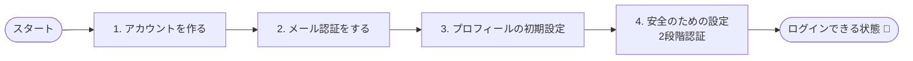
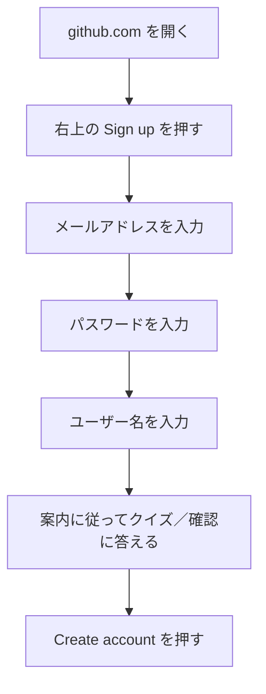
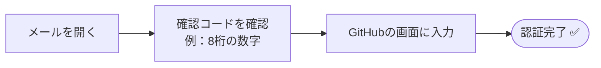
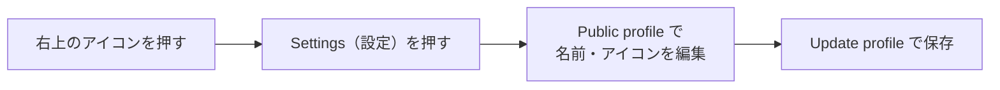
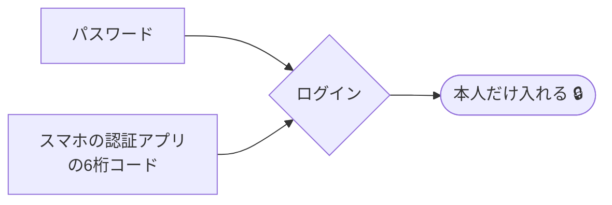
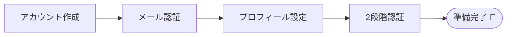

# アカウント作成と初期設定

!!! info "この章のゴール"
    自分のGitHubアカウントを作り、**ログインできる状態**になること。
    あわせて、安全に使うための初期設定（2段階認証など）まで済ませます。

## 全体の流れ

これからやることを、先に地図で見ておきましょう。所要時間はだいたい **10〜15分** です。

!!! warning "はじめに：会社のルールを確認"
    会社で使う場合は、**会社のメールアドレス**で登録するか、社内ルールに従ってください。
    すでに「このメールアドレスで作って」と案内されている場合は、それに従いましょう。

---

## 1. アカウントを作る

ブラウザ（Chrome や Edge）で [https://github.com](https://github.com) を開きます。

操作の対応表です。英語のボタンが多いので、迷ったらここを見てください。

| 画面の表示（英語） | 意味・やること |
|---|---|
| **Sign up** | 新規登録（アカウントを作る） |
| **Enter your email** | メールアドレスを入力 |
| **Create a password** | パスワードを作る |
| **Enter a username** | ユーザー名（半角英数字）を決める |
| **Continue / Create account** | 次へ進む／登録を確定する |

!!! quote "📷 画面キャプチャ枠（あとで差し込み）"
    ここに **Sign up ボタンの場所** がわかる画面を入れます。
    画像が用意できたら、この枠を次の1行に置き換えてください：
    `{ width="700" }`

!!! danger "個人情報の取り扱いに注意"
    - 登録に使うメールアドレスやパスワードは、**この資料や社内チャットに貼り付けないでください**。
    - パスワードは他サービスと**使い回さない**でください。

??? tip "ユーザー名の決め方（クリックで開く）"
    - 半角の英数字とハイフンが使えます（例：`taro-supportas`）。
    - 後から変更もできますが、URLが変わるため**最初に決めておく**のがおすすめです。
    - 実名でなくてもかまいませんが、社内で使うなら**誰か分かる名前**にしておくと便利です。

---

## 2. メール認証をする

登録したメールアドレスに、GitHubから確認コード（数字）が届きます。

!!! note "コードが届かないときは"
    - **迷惑メールフォルダ**を確認してください。
    - 数分待っても届かなければ、画面の **Resend（再送）** を押します。
    - メールアドレスの打ち間違いがないか、もう一度確認しましょう。

!!! quote "📷 画面キャプチャ枠（あとで差し込み）"
    確認コードの入力画面を入れる場所です。
    `{ width="700" }`

---

## 3. プロフィールの初期設定

ログインできたら、最低限のプロフィールを整えます。**あとからでも変更できる**ので、まずは軽くでOKです。

- **表示名（Name）**：社内で誰か分かる名前にしておくと、共同作業のときに便利です。
- **アイコン（Profile picture）**：顔写真でなくてもOK。設定すると見分けがつきやすくなります。

設定場所への行き方：

!!! quote "📷 画面キャプチャ枠（あとで差し込み）"
    Settings（設定）の場所がわかる画面を入れます。
    `{ width="700" }`

---

## 4. 安全のための設定（2段階認証）

!!! warning "ここは必ず設定しましょう"
    GitHubは大切なファイルを置く場所です。**2段階認証（2FA）** を設定すると、
    万一パスワードが漏れても、本人以外はログインできなくなります。

2段階認証は、ログイン時に「パスワード」＋「スマホアプリの数字」の**2つ**を使う仕組みです。

設定の入り口：**Settings → Password and authentication → Two-factor authentication** から進めます。
画面の案内に従って、スマホの認証アプリ（例：Google Authenticator など）と連携します。

!!! danger "リカバリーコードは必ず保管"
    2段階認証を設定すると、**リカバリーコード**（緊急用の合言葉）が表示されます。
    スマホを失くしたときの命綱なので、**安全な場所に保管**してください。社内チャット等には貼らないこと。

---

## この章のまとめ

- [x] GitHubにログインできる
- [x] プロフィールを設定した
- [x] 2段階認証で安全にした

!!! success "次のステップ"
    アカウントの準備ができました。
    このガイドでは、これ以降の操作を **VSCode + Claude** を使って進めていきます。
    次の章で、自分のファイル置き場（リポジトリ）を作ってみましょう。

    👉 [最初の一歩（リポジトリを作る）](first-steps.md)
