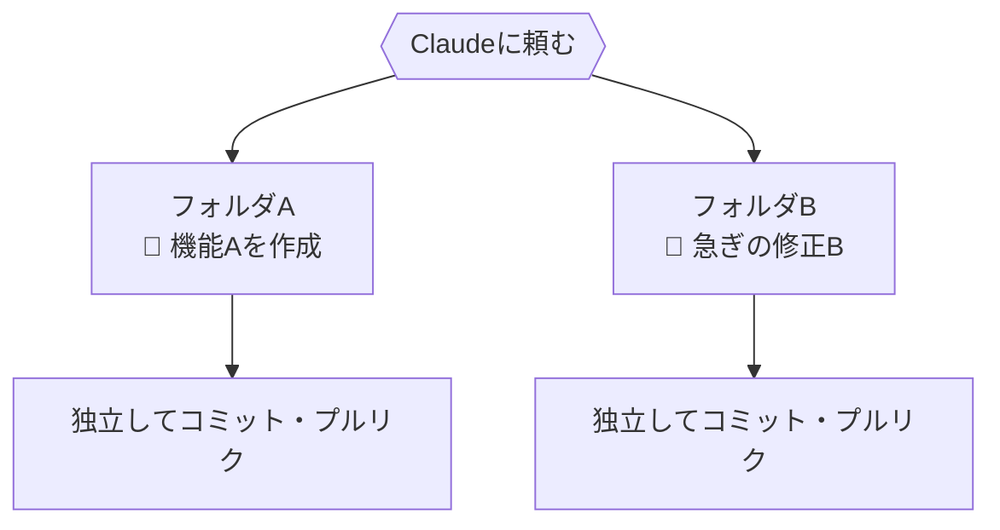
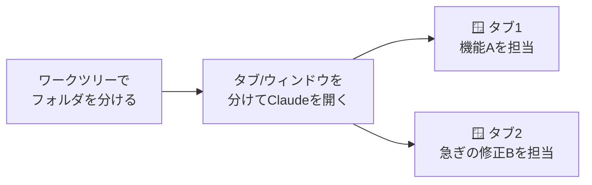

# もっと使う（上級編・ワークツリー）

!!! info "この章のゴール"
    **ワークツリー（worktree）** が「何のための仕組みか」を理解し、必要なときに使えるようになること。

!!! warning "ここは上級トピックです"
    ふだんの作業（[コミット](commit-push.md)・[プルリク](collaboration.md)）に慣れてからで大丈夫です。
    「2つのブランチを同時に開きたい」と感じたときに読み返してください。

<figure markdown="span">
  { width="340" }
  <figcaption>2つの作業を、行き来せずに同時に進められる</figcaption>
</figure>

## ワークツリーとは

**同じリポジトリ（repo）を、複数のフォルダに同時に開ける仕組み**です。

ふつうは1つのフォルダで作業し、ブランチを切り替えると中身が入れ替わります。
ワークツリーを使うと、**ブランチごとに別々のフォルダ** を持てるので、切り替えずに同時進行できます。

=== ":material-folder: ふつう（1フォルダ・切り替え式）"

    ```mermaid
    flowchart TD
        R[(リポジトリ)] --> F[1つのフォルダ]
        F -->|ブランチ切替| B1[main を表示]
        F -->|切替| B2[feature を表示]
    ```

    同時に開けるのは **どちらか片方** だけ。

=== ":material-file-tree: ワークツリー（複数フォルダ）"

    ```mermaid
    flowchart TD
        R[(同じリポジトリ)] --> FA[フォルダA<br/>main]
        R --> FB[フォルダB<br/>feature]
    ```

    **両方を同時に** 開いて作業できる。

## どんなときに便利？

- :material-flash: **急な差し込み対応**：機能Aを作っている途中で、急ぎの修正Bが入ったとき。作業を中断・退避せずに、別フォルダでBを直せる
- :material-compare: **見比べ**：2つのブランチを並べて、動きや表示を比較したい
- :material-progress-clock: **時間のかかる処理の待ち時間**：片方で重い処理を動かしながら、もう片方で別の作業を続ける

!!! tip "ブランチとの違い"
    - **ブランチ** … 作業の“枝”そのもの
    - **ワークツリー** … その枝を“別の机（フォルダ）で開く”仕組み

    ブランチが分かっていれば、ワークツリーは「その応用」です。

## :material-robot-happy-outline: Claudeと組み合わせると、もっと便利

**結論：ワークツリーは、Claudeに作業を頼むスタイルと特に相性がよい仕組みです。**

**理由：** Claudeへのお願いは「いま開いているフォルダ」に対して進みます。
フォルダを分けておけば、**複数のお願いが互いにぶつからず**、安心して同時に進められるからです。
（1つのフォルダで何でも同時に頼むと、変更が混ざってしまいがちです。）

**具体例：**

- 「機能Aをこのフォルダで進めて」「急ぎの修正Bは別フォルダで」と **並行してお願い** できる
- 片方でClaudeが作業している間に、もう片方で **別の相談・別の作業** を進められる
- フォルダごとに **独立してコミット → プルリク** できるので、後から整理しやすい



!!! tip "頼み方の例"
    ```text
    機能A用と修正B用に、それぞれワークツリー（別フォルダ）を用意して。
    まず修正Bのフォルダを開いて、そっちから直していこう。
    ```

!!! note "増やしすぎに注意"
    フォルダを増やしすぎると、どれがどれだか分からなくなります。
    目安は **「同時に進めたいものが2〜3個あるとき」**。迷ったらClaudeに「いまのワークツリーの状況を整理して」と聞けます。

## ワークツリーを作ってみる

ためしに、`feature` ブランチを別フォルダで開いてみます。

=== ":material-robot-happy-outline: Claudeに頼む"

    ```text
    いまのリポジトリで、feature というブランチを
    別のフォルダ（ワークツリー）として作って、
    そのフォルダを VSCode の新しいウィンドウで開いて。
    ```

    Claudeがフォルダの作成と切り替えを進めてくれます。
    どこに作るか・名前をどうするかも相談できます。

=== ":material-console: 自分でコマンド（VSCodeのターミナル）"

    VSCodeのメニュー「ターミナル」→「新しいターミナル」で、次を実行します。

    ```bash
    # feature ブランチを、隣の「myrepo-feature」フォルダとして開く
    git worktree add ../myrepo-feature feature
    ```

    作られたフォルダを **新しいウィンドウで開く**：

    ```text
    VSCodeメニュー → ファイル → フォルダーを開く → myrepo-feature を選ぶ
    ```

    !!! note "コマンドの意味（覚えなくてOK）"
        `git worktree add <フォルダ名> <ブランチ名>` で、
        「そのブランチ専用のフォルダ」をもう1つ作る、という意味です。

## VSCodeでClaudeのタブを分けて、同時に別タスク

**結論：ワークツリーで分けたフォルダごとに、Claudeを別のタブ（または別ウィンドウ）で開くと、それぞれに別のタスクを並行で任せられます。**

**理由：** Claudeの会話（セッション）は **「いま開いているフォルダ」に紐づき**、1つ1つが独立しています。
タブやウィンドウを分ければ、会話が混ざらずに別タスクを同時に進められるからです。



### 開き方（2通り）

=== ":material-tab: 新しいタブで開く"

    同じウィンドウの中に、Claudeをもう1つ追加します。

    1. コマンドパレットを開く（Mac: `Cmd`+`Shift`+`P` / Windows: `Ctrl`+`Shift`+`P`）
    2. **`Claude Code: Open in New Tab`** を選ぶ

    !!! note "コマンドが見つからないとき"
        コマンドパレットで **`Claude`** と打つと、関連メニューが一覧で出ます。
        表示名はバージョンで少し変わることがあります。

=== ":material-dock-window: 新しいウィンドウで開く（おすすめ）"

    フォルダ（ワークツリー）ごとに分けるなら、**ウィンドウごと分ける** のが分かりやすく、公式でも推奨されています。

    1. コマンドパレット → **`Claude Code: Open in New Window`** を選ぶ
    2. または、各ワークツリーのフォルダを **別ウィンドウで開いて**（ファイル → フォルダーを開く）、それぞれでClaudeを起動する

### 使い方のコツ

- **1タスク＝1つの会話** にする。フォルダ（ワークツリー）ごとに会話を分けると、内容が混ざりません
- それぞれのタブ/ウィンドウで、担当タスクを伝える

    | 開いている場所 | お願いする内容（例） |
    |---|---|
    | フォルダA のタブ | `機能Aを実装して` |
    | フォルダB のタブ | `急ぎの修正Bをして` |

- **タブの色で状態が分かります**
    - 🔵 青い点 … 「進めていい？」と **許可を待っている**
    - 🟠 オレンジ … その会話の **作業が終わった**

!!! danger "同じ会話を2か所で開かない"
    まったく同じ会話（セッション）を2つのタブ/ウィンドウで同時に開くと、
    メッセージが混ざってしまうことがあります。**タスクごとに別の会話** を使ってください。

!!! quote "📷 画面キャプチャ枠（あとで差し込み）"
    コマンドパレットで「Claude Code: Open in New Tab / New Window」を選ぶ画面を入れます。
    `{ width="700" }`

??? info "もっとくわしく（公式ドキュメント・英語）"
    - VSCode拡張の使い方： <https://code.claude.com/docs/en/vscode-extension>
    - ワークツリーでの並行作業： <https://code.claude.com/docs/en/worktrees>

## 確認と片付け

作業が終わったら、使わないワークツリーは片付けます。

=== ":material-robot-happy-outline: Claudeに頼む"

    ```text
    いまあるワークツリーの一覧を見せて。
    もう使わない myrepo-feature のワークツリーは片付けて。
    ```

=== ":material-console: 自分でコマンド"

    ```bash
    # いまあるワークツリーの一覧
    git worktree list

    # 使い終わったワークツリーを削除
    git worktree remove ../myrepo-feature
    ```

!!! danger "片付け前の注意"
    削除するフォルダに **保存していない変更（未コミット）** が残っていないか、先に確認しましょう。
    不安なときは「このワークツリー、消して大丈夫？」とClaudeに聞くと安心です。

## この章のまとめ

<figure markdown="span">
  { width="320" }
  <figcaption>同時進行も、整理しながら安全に</figcaption>
</figure>

- [x] ワークツリーは「同じrepoを複数フォルダで同時に開く」仕組み
- [x] 急な差し込みや見比べに便利
- [x] 作る／一覧／片付けの流れが分かった

!!! success "次のステップ"
    上級編はここまで。最後に、**困ったときの対処** を確認しておきましょう。

    👉 [困ったときのQ&A](troubleshooting.md)
