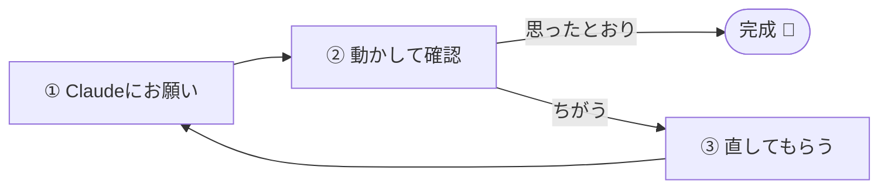

# AIで作ってみる（ハンズオン）

!!! info "この章のゴール"
    AI（Claude）と一緒に、**小さなものを実際に作ってみる** こと。
    [AIで開発するとは](ai-intro.md) の「お願い → 動かす → 直す」を体で覚えます。

<figure markdown="span">
  { width="320" }
  <figcaption>小さく作って、動かして、直す。これだけです</figcaption>
</figure>

!!! tip "完璧を目指さない"
    練習なので、うまくいかなくてOK。**「動かして確かめる」** ことだけ意識しましょう。

---

## まずは題材を選ぶ

次の3つから、興味のあるものを1つ選んでください（どれも短時間でできます）。

=== ":material-web: ① 自己紹介Webページ"

    ブラウザで開ける、自分の自己紹介ページを作ります。

    **Claudeへの頼み方：**

    ```text
    自己紹介のWebページ（HTML）を1ファイルで作って。
    名前・好きなこと・ひとことを表示して、やさしい見た目にして。
    作ったらブラウザでの開き方も教えて。
    ```

=== ":material-console: ② あいさつスクリプト"

    名前を入れると、あいさつを返す小さなプログラムを作ります。

    **Claudeへの頼み方：**

    ```text
    名前を入力すると「こんにちは、○○さん！」と表示する
    かんたんなスクリプトを作って。動かし方も教えて。
    ```

=== ":material-cog: ③ ちょっとした自動化"

    定型作業（例：ファイル名の一括変更）を自動化します。

    **Claudeへの頼み方：**

    ```text
    フォルダの中の画像ファイルの名前を、
    「写真-01」「写真-02」…と連番に変える方法を作って。
    まず1つのフォルダで試せるようにして。
    ```

---

## 作る流れ（共通）

題材が決まったら、[基本ループ](ai-intro.md) で進めます。



1. **お願いする**：上の例文を送る
2. **動かす**：できたファイルを、教わったとおりに開く／実行する
3. **直す**：イメージと違ったら、具体的に伝える
    - 例：「文字をもっと大きく」「背景を水色に」「エラーが出た：（貼る）」
4. 気に入ったら、[コミット](commit-push.md) して保存

!!! tip "“ちょっとずつ”が成功のコツ"
    最初から全部を頼まず、**まず動く最小のもの → 少しずつ追加** が、いちばん速くて確実です。

---

## できたら保存・公開してみる

- 作ったものは [リポジトリ](first-steps.md) に置いて [コミット](commit-push.md)
- Webページなら、[GitHub Pages](glossary.md) で公開もできます（このサイトと同じ仕組み）
- 公開する前に [AIと安全に付き合う](ai-safety.md)・[安全に使う](security.md) の注意を確認

## この章のまとめ

- [x] 題材を1つ選んで、AIと作ってみた
- [x] 「お願い → 動かす → 直す」を体験した
- [x] 完成したものを保存（コミット）できた

!!! success "次のステップ"
    作る中で **エラー** に出会ったはずです。次は、エラーとの上手な付き合い方を覚えましょう。

    👉 [エラーとの付き合い方](ai-errors.md)
