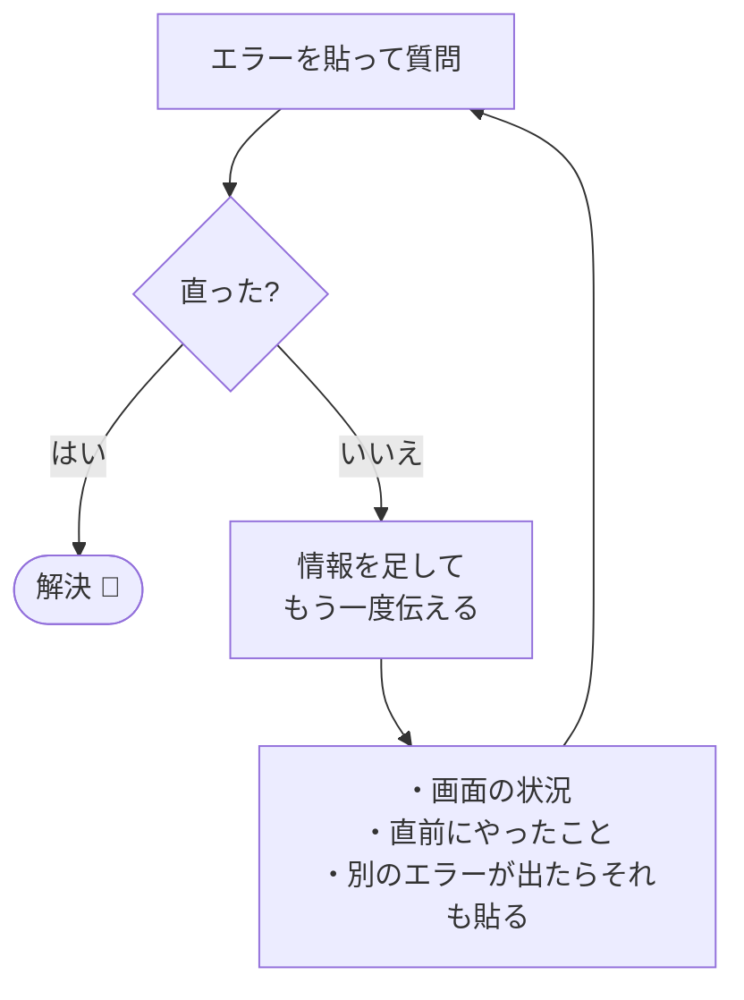

# エラーとの付き合い方

!!! info "この章のゴール"
    エラー（赤い文字・英語のメッセージ）が出ても **怖がらず**、AIに頼んで直せるようになること。

<figure markdown="span">
  { width="340" }
  <figcaption>エラーは“失敗”ではなく、“直し方のヒント”です</figcaption>
</figure>

!!! tip "まず知っておきたいこと"
    エラーは **悪いこと・あなたのせい、ではありません**。
    「ここに問題があるよ」という案内であり、**直し方のヒント** が書かれています。

---

## 基本：エラーをそのままClaudeに貼る

**結論：エラーメッセージを丸ごとコピーして、Claudeに貼って聞くのがいちばん速いです。**

```text
このエラーが出ました。意味と、直し方を教えて。

（ここにエラーメッセージをそのまま貼り付け）
```

**理由：** エラーメッセージには原因のヒントが含まれています。Claudeはそれを読んで、原因と対処を説明できます。

!!! warning "貼るときの注意"
    エラー文に **パスワードや個人情報** が混じっていないか、貼る前に確認しましょう（→ [AIと安全に付き合う](ai-safety.md)）。

---

## 上手な伝え方（直りやすくなる3点）

| 伝えること | 例 |
|---|---|
| **何をしたら** 出たか | 「保存して実行したら」 |
| **どうなってほしい** か | 「本当はメッセージを表示したい」 |
| **エラー全文** | （省略せず丸ごと貼る） |

```text
○○をしたら、このエラーが出ました。本当は△△したいです。直し方を教えて。

（エラー全文を貼り付け）
```

---

## 直らないとき



- **情報を足す**：「さっきの方法を試したら、今度はこのエラーが出た：（貼る）」
- **小さく切る**：一度に直そうとせず、1つずつ
- **状況を見せる**：「いまこういう画面です」と具体的に

!!! tip "それでも解決しないとき"
    詳しい人に聞くか、[困ったときのQ&A](troubleshooting.md) を確認しましょう。
    エラー全文を伝えれば、相手も助けやすくなります。

---

## この章のまとめ

- [x] エラーは「直し方のヒント」だと分かった
- [x] エラー全文をそのままClaudeに貼って聞ける
- [x] 「何をして・どうなってほしいか」を添えると直りやすい

!!! success "次のステップ"
    エラーが怖くなくなれば、AI開発はぐっと進めやすくなります。
    さらに使いこなしたい人は [もっと使う（上級編）](advanced.md) へ。
