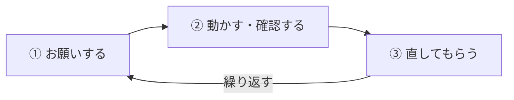

# AIで開発するとは

!!! info "この章のゴール"
    AI（Claude）と一緒に開発を進めるときの **考え方** をつかむこと。
    「できること・苦手なこと」「基本の進め方」「ちょうどよい期待値」を押さえます。

<figure markdown="span">
  { width="340" }
  <figcaption>Claudeは「優秀だけど、たまに間違える相棒」</figcaption>
</figure>

このガイドでは、GitHubの操作を **Claude（AI）に頼みながら** 進めます。
うまく付き合うために、まずAIの性格を知っておきましょう。

---

## Claudeにできること／苦手なこと

**結論：得意なことは任せ、苦手なことは人がフォローする** ——この役割分担が大事です。

| :material-check-circle: 得意なこと | :material-alert-circle: 苦手・注意が必要なこと |
|---|---|
| コードを書く・直す・説明する | **事実をもっともらしく間違える**（ハルシネーション） |
| エラーの原因を調べて直す | **最新情報を知らない**（学習した時点まで） |
| 文章・資料・データの整理 | **社内固有のこと**は、伝えないと分からない |
| 調べもの・たたき台づくり | **曖昧な指示**だと意図を外す |
| GitHub操作（コミット・PRなど） | **大きすぎる一括依頼**は精度が落ちる |
| 定型作業の自動化 | **厳密な正確さ**（計算・数値）は要検証 |

**理由：** Claudeは「学んだ大量の文章から、もっともらしい続きを作る」仕組みです。
だから文章やコードは得意ですが、**知らないことも自信たっぷりに答えてしまう** ことがあります。

**具体例：**

- ✅ 得意：「このエラーの意味を教えて」「READMEのたたき台を作って」→ すぐ役立つ
- ⚠️ 注意：「最新の○○は？」「うちの社内システムの△△は？」→ **知らない/古い可能性**。必ず裏を取る

---

## 「お願いして → 動かして → 直す」の基本ループ

**結論：AI開発は、一発で完成させるのではなく、小さく回して近づけていく作業です。**

| ステップ | やること | コツ |
|---|---|---|
| **① お願いする** | やりたいことを具体的に伝える | 「何を・どうしたいか」を1つずつ |
| **② 動かす・確認する** | 出力を実際に動かして／見て確かめる | **鵜呑みにせず、必ず自分で確認** |
| **③ 直してもらう** | 違った点を伝えて修正してもらう | 「ここがこうだった」と具体的に |

**理由：** AIは一発で完璧を出すとは限りません。でも **「違う」を伝えると素早く直せる** のが強み。
人どうしの「相談しながら仕上げる」のと同じです。

**具体例：**

1. 「問い合わせフォームを作って」
2. 動かしてみる → 「送信ボタンが反応しない」
3. 「送信ボタンが反応しないので直して。エラーはこれ：（貼る）」
4. → 直る。これを数回繰り返して完成へ

!!! tip "コツは“小さく頼む”"
    大きな依頼を一度に投げるより、**小さく区切って①②③を回す** ほうが、速くて確実です。

---

## ちょうどよい期待値の持ち方

**結論：Claudeを「魔法の自動販売機」ではなく「優秀なアシスタント」と考えると、うまく付き合えます。**

<figure markdown="span">
  { width="300" }
  <figcaption>速くて優秀、でも確認は必要</figcaption>
</figure>

持っておくとよい心構え：

- 🤝 **相棒であって、丸投げ先ではない** … たたき台や下書きは任せ、**最終確認と責任は人**
- 🔍 **出力は必ず確かめる** … 特に数字・事実・社外秘に関わる部分は鵜呑みにしない
- 🧩 **小さく・具体的に頼む** … 文脈（状況・ファイル名・目的）を伝えるほど精度が上がる
- 🔁 **一回で完璧を求めない** … 「違ったら直す」前提で気軽に試す
- 🙋 **「分からない」と言わせてOK** … 「不確かなら、そう教えて」と頼むと、当てずっぽうを減らせる

**理由：** 期待値が高すぎると「間違えた＝使えない」とがっかりし、低すぎると便利さを活かせません。
**「速くて優秀、でも確認は必要」** という現実的な期待値が、いちばん成果につながります。

**具体例：**

- ❌ 期待しすぎ：「全部おまかせで完璧なシステムを作って」→ 確認せず使う → 事故のもと
- ⭕ ちょうどよい：「この部分を作って。動かして確認するから、まずたたき台を」→ 確認しながら仕上げる

---

## この章のまとめ

- [x] Claudeの得意・苦手が分かった
- [x] 「お願い → 動かす → 直す」のループが分かった
- [x] 「速くて優秀、でも確認は必要」という期待値を持てた

!!! success "次のステップ"
    AIとの付き合い方がつかめました。次は、開発を始めるための **準備（アカウント作成）** をしましょう。

    👉 [アカウント作成と初期設定](account-setup.md)
