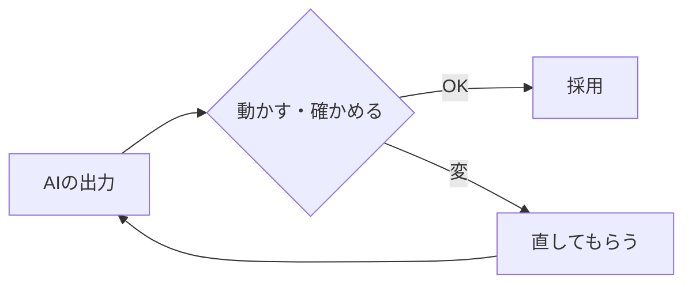

# AIと安全に付き合う

!!! info "この章のゴール"
    AI（Claude）を使うときの **AI特有の注意点** を押さえること。
    「渡してはいけない情報」「誤りに注意」「必ず検証」「生成物の扱い」を学びます。

<figure markdown="span">
  { width="300" }
  <figcaption>少しの注意で、AIは安心して使えます</figcaption>
</figure>

!!! note "GitHubの安全とあわせて"
    GitHub側の安全（2段階認証・公開範囲など）は [安全に使う](security.md) を参照してください。
    この章は **AIならではの注意** を扱います。

---

## 1. AIに渡してはいけない情報

**結論：AIに送る文章にも、機密・個人情報・認証情報は入れないでください。**

- :material-key: パスワード・APIキー・トークンなどの **認証情報**
- :material-account: **個人情報**（氏名・住所・電話番号・メールアドレス）
- :material-domain: 会社の **機密・顧客情報・案件名** など社外秘

**理由：** AIに送った内容は、サービス側で処理・保存される場合があります。社内ルールで利用が認められた範囲を超える情報は送らないのが基本です。

!!! tip "迷ったら伏せる／相談する"
    実際の値の代わりに「（ここにパスワード）」のような **伏せ字** で頼めば、たいてい用は足ります。
    判断に迷うときは、社内ルールを確認し、Claudeに「この内容は送って大丈夫？」と聞くのも有効です。

---

## 2. もっともらしい誤り（ハルシネーション）に注意

**結論：AIは、知らないことも自信たっぷりに答えることがあります。**

- 存在しない機能・関数を「ある」と言う
- 古い情報を最新のように答える
- 数字や事実をそれっぽく間違える

**理由：** AIは「もっともらしい続き」を作るのが得意な反面、**事実かどうかの保証はしません**。

!!! tip "見抜くコツ"
    「不確かなら “分からない” と言って」「根拠（出典）も教えて」と添えると、当てずっぽうを減らせます。

---

## 3. 出力は必ず「検証」する

**結論：AIの出力は、そのまま使わず、動かして・見て確かめてから使います。**

- コードは **実際に動かして** 期待どおりか確認
- 文章・数字は **事実かどうか** を確認
- 重要な判断は **人が最終チェック**

---

## 4. 生成物のライセンス・著作権

**結論：AIが出したコードや文章も、ライセンス・権利に配慮して使います。**

- 既存の著作物を **そのまま転記** していないか気をつける
- 社外公開する場合は、**ライセンス上問題がないか** を確認
- 不安なときは、由来や扱いをClaudeに確認し、最終判断は人が行う

!!! warning "会社のルールが最優先"
    生成物の利用範囲・公開可否は、**社内のルールやガイドラインに従って** ください。

---

## この章のまとめ

- [x] 機密・個人情報・認証情報は **AIにも渡さない**
- [x] ハルシネーション（もっともらしい誤り）に注意する
- [x] 出力は **動かして・確かめて** から使う
- [x] 生成物のライセンス・責任は **人が確認** する

!!! success "次のステップ"
    安全に付き合うコツを押さえられました。さらに使いこなしたい人は、次の **上級編** へ。

    👉 [もっと使う（上級編）](advanced.md)
