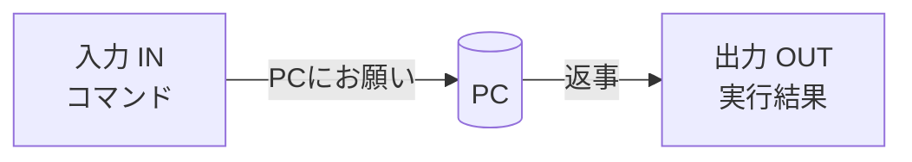

# 付録：Claudeの頼み方とMarkdown

<figure markdown="span">
  { width="320" }
  <figcaption>困ったら、まず日本語で相談</figcaption>
</figure>

## :material-robot-happy-outline: Claudeへの頼み方（プロンプト例）

!!! tip "うまく頼む3つのコツ"
    1. **やりたいことを具体的に**（ファイル名・ブランチ名なども）
    2. **いまの状況を伝える**（「自分専用のブランチです」など）
    3. **エラーはそのまま貼る**（メッセージをコピペ）

| やりたいこと | 頼み方の例 |
|---|---|
| リポジトリを作る | `practice という名前で、自分だけ見られるリポジトリを作って。READMEも付けて。` |
| コミット＆反映 | `いまの変更を、内容に合ったメッセージでコミットして、GitHubに反映して。` |
| ブランチを作る | `fix-typo というブランチを作って、そっちに切り替えて。` |
| プルリクを作る | `いまのブランチの変更で、プルリクを作って。タイトルと説明も書いて。` |
| 取り消す | `さっきのコミット（メモを追記）を取り消して（リバートして）。` |
| 最新を取り込む | `GitHubの最新の状態を、いまの場所に取り込んで。` |
| 調べる・直す | `このエラーの意味と直し方を教えて：（エラーメッセージを貼る）` |
| 安全確認 | `このファイル、GitHubに上げても大丈夫？ 機密が入っていないか見て。` |

## :material-tools: Claude操作中によく出てくる言葉（道具の名前）

Claudeが作業するとき、画面に **`Bash` `Read` `Edit`** などの名前が出ます。
これは **Claudeが使う“道具”の名前** です。中身を覚える必要はありませんが、「いま何をしようとしているか」が分かると安心です。

| 表示される名前 | Claudeが何をしているか |
|---|---|
| **Bash**（バッシュ） | コマンドを実行する（PCに文字で命令する道具） |
| **Read** | ファイルの中身を **読む** |
| **Write** | 新しいファイルを **作る／書く** |
| **Edit** | 既存ファイルを **部分的に直す** |
| **Grep** | ファイルの中の **文字を検索** する |
| **Glob** | **ファイル名** で探す |
| **WebSearch / WebFetch** | **ネットを検索**／ページを取得する |
| **TodoWrite** | **作業リスト**（やることメモ）を作る・更新する |

### Bash の「入力（IN）」と「出力（OUT）」

`Bash` を実行すると、画面に **2つ** が表示されます。区別が分かると、ぐっと読みやすくなります。

- **入力（IN）** … Claudeが実行する **コマンド（命令文）**。「PCへのお願い」
- **出力（OUT）** … それを実行した **結果**。「PCからの返事」

| | 例 | 意味 |
|---|---|---|
| 入力（IN） | `git status` | 「いま何が変わったか教えて」という命令 |
| 出力（OUT） | `modified: メモ.txt` など | 「メモ.txt が変わっています」という返事 |



!!! tip "出力（OUT）はPCからの返事"
    出力は英語や記号が多くて難しく見えますが、**Claudeがそれを読んで次の判断** をします。中身を全部読めなくても大丈夫です。
    赤い文字やエラーが出ても、それは直し方のヒント。困ったら [エラーとの付き合い方](ai-errors.md) を見てください。

!!! note "「ターミナル」「シェル」「Bash」って？"
    - **ターミナル** … 文字でPCに命令する画面（VSCodeの下のほうに出せます）
    - **シェル／Bash** … その命令を受け取って実行する仕組み（Bashはその代表的な種類）

### 「実行してもいいですか？」と聞かれたら（許可）

Claudeは、ファイルを変えたりコマンドを実行する前に、**「やっていいですか？」と確認** することがあります（タブが🔵青い点になります）。

- 内容を見て、問題なければ **許可（Allow）**
- よく分からない・不安なときは **いったん断って**、Claudeに「これは何をする操作？」と聞けばOK

!!! tip "全部を覚えなくて大丈夫"
    名前の意味が分からなくても、**「何のために」やろうとしているか** をClaudeに聞けば説明してくれます。
    迷ったら「いまの操作を、やさしく説明して」と頼みましょう。

!!! warning "表示は変わることがあります"
    道具の名前や種類は、バージョンによって増えたり変わったりします。ここに挙げたのは一例です。

## :material-language-markdown: Markdownの書き方（最小ガイド）

README や Issue、プルリクの説明で使う、かんたんな書き方のルールです。

| 書き方 | 表示される結果 |
|---|---|
| `# 大見出し` / `## 中見出し` | 見出し |
| `- 項目` | ・箇条書き |
| `1. 項目` | 1. 番号付きリスト |
| `**太字**` | **太字** |
| `[表示文字](URL)` | リンク |
| `` | 画像 |
| `` `コード` `` | `コード`（等幅） |
| `- [ ]` / `- [x]` | ☐ / ☑ チェックボックス |
| `> 引用` | 引用ブロック |

### 書いてみる例

````markdown
# わたしのプロジェクト

これは **練習用** のリポジトリです。

## やること
- [x] READMEを書く
- [ ] 写真を追加する

参考：[GitHub入門ガイド](https://example.com)
````

!!! tip "迷ったらClaudeに"
    「この内容をMarkdownで、見出しと箇条書きにして」と頼めば、整えてくれます。
    まずは `#`（見出し）と `-`（箇条書き）だけ覚えれば十分です。
