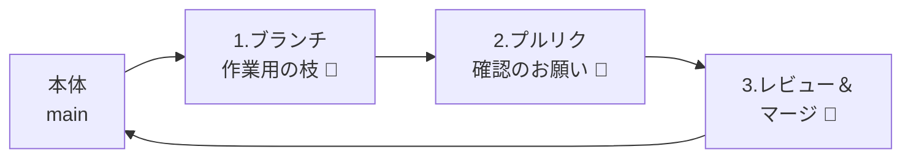
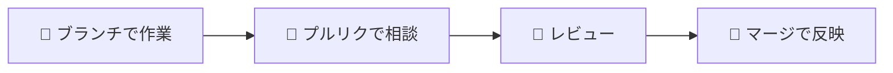

# みんなで使う（プルリク・マージ）

!!! info "この章のゴール"
    複数人で安全に共同作業する流れ（**ブランチ → プルリクエスト → マージ**）が分かること。

<figure markdown="span">
  { width="320" }
  <figcaption>いきなり本体を変えず、「相談してから反映」が基本</figcaption>
</figure>

全体の流れはこうです。



!!! tip "おすすめの進め方"
    いきなり本体を変えず、「**ブランチで作業 → プルリクで相談 → マージ**」の流れを習慣にすると安全です。

---

## 1. ブランチを作る

**ブランチ**は「作業用の分かれ道」です（→ [用語集](glossary.md)）。
本体（みんなが使う版＝`main`）に影響を与えずに、別の場所で安心して作業できます。

=== ":material-robot-happy-outline: Claudeに頼む"

    ```text
    「fix-typo」という名前のブランチを作って、そっちに切り替えて。
    ```

    どんなブランチ名がいいかも相談できます（例：`add-photos`、`update-readme`）。

=== ":material-cursor-default-click-outline: 自分で操作（VSCode）"

    1. VSCode左下の **ブランチ名（例：`main`）** をクリック
    2. **＋ 新しいブランチの作成** を選ぶ
    3. ブランチ名を入れる（例：`fix-typo`）
    4. そのブランチに切り替わる

!!! note "ブランチ名のつけ方"
    「何をするか」が分かる名前にします。例：`fix-typo`（誤字直し）、`add-photos`（写真追加）。

---

## 2. 変更してプルリクエストを出す

ブランチで変更・コミット・プッシュしたら（→ [コミットの章](commit-push.md)）、
**プルリクエスト（PR）** で「この変更を本体に入れていいですか？」と相談します。

=== ":material-robot-happy-outline: Claudeに頼む"

    ```text
    いまのブランチの変更で、プルリクエストを作って。
    タイトルと説明も、変更内容に合わせて書いて。
    ```

=== ":material-cursor-default-click-outline: 自分で操作（GitHubサイト）"

    1. リポジトリの画面を開くと **Compare & pull request** ボタンが出る → 押す
    2. **タイトル** と **説明**（何を・なぜ変えたか）を書く
    3. **Create pull request** を押す
    4. 確認してほしい人がいれば **Reviewers** で指定する

    !!! quote "📷 画面キャプチャ枠（あとで差し込み）"
        プルリクエスト作成画面を入れます。
        `{ width="700" }`

---

## 3. レビューしてマージする

ほかの人に見てもらい（**レビュー**）、OKなら本体に合流（**マージ**）します。

<figure markdown="span">
  { width="300" }
  <figcaption>「これでOK」となったら本体に取り込む</figcaption>
</figure>

**レビューする側：**

1. プルリクの **Files changed** で変更点を確認
2. 気づいた点は **コメント** を書く
3. 問題なければ **Approve（承認）**

**マージする側：**

1. 承認されたら **Merge pull request** を押す
2. **Confirm merge** で確定
3. 使い終わったブランチは **Delete branch** で片付けてOK

=== ":material-robot-happy-outline: Claudeに頼む"

    ```text
    このプルリクをレビューして、問題がなければマージして。
    使い終わったブランチも消して。
    ```

=== ":material-cursor-default-click-outline: 自分で操作（GitHubサイト）"

    上の手順どおり、**Approve → Merge pull request → Confirm merge** と進めます。

!!! warning "マージの前に"
    マージは「本体に反映する」操作です。**内容を確認してから** 行いましょう。
    不安なときは、詳しい人やClaudeに「この変更、マージして大丈夫？」と聞くと安心です。

---

## この章のまとめ



- [x] ブランチで安全に作業できる
- [x] プルリクで相談できる
- [x] レビューしてマージできる

!!! success "次のステップ"
    共同作業の流れがつかめました。
    もう少し使いこなしたい人は、次の「もっと使う（上級編）」へ。急がない人は読み飛ばして [Q&A](troubleshooting.md) に進んでもOKです。

    👉 [もっと使う（上級編・ワークツリー）](advanced.md)
