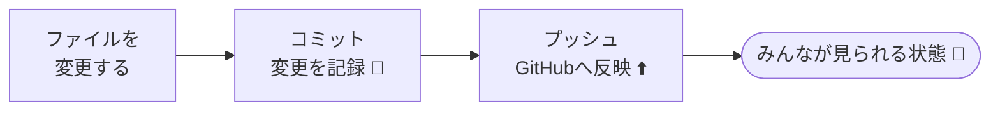

# 変更を記録する（コミット）

!!! info "この章のゴール"
    ファイルを変更して、その変更を **記録（コミット）** し、**GitHubに反映（プッシュ）** できるようになること。

<figure markdown="span">
  { width="320" }
  <figcaption>「変更 → 記録 → アップロード」が基本の流れ</figcaption>
</figure>



## 1. コミットとは（おさらい）

**コミット**は、ゲームの「セーブポイント」のようなものです（→ [用語集](glossary.md)）。
「ここまでの変更に名前をつけて記録する」のがコミット。あとからその時点に戻れます。

そして **プッシュ** は、そのセーブを **GitHub（ネット上）にアップロード** することです。

!!! tip "コミットとプッシュの関係"
    - **コミット** … 手元で「記録」する（まだ自分だけ）
    - **プッシュ** … その記録を「GitHubに送る」（みんなに共有）

---

## 2. 変更してコミット・プッシュする

ためしに、前章で作ったファイルを少し書き換えて、記録してみましょう。
操作は4通りで並べます（→ 選び方は [最初の一歩](first-steps.md) と同じ）。

=== ":material-robot-happy-outline: Claudeに頼む"

    ```text
    メモ.txt に「2行目を追加しました」と1行足して。
    変更に合ったコミットメッセージも考えて記録（コミット）し、GitHubに反映して。
    ```

    Claudeが「**メッセージ作成 → コミット → プッシュ**」までまとめて進めてくれます。
    コミットメッセージを自分で考えなくてよいのが、Claudeに頼む大きなメリットです。
    （もちろん「メッセージは "メモを追記" にして」と自分で指定することもできます。）

=== ":material-microsoft-visual-studio-code: VSCodeで操作"

    1. VSCodeでファイルを編集して **保存**（`Ctrl`/`⌘` + `S`）
    2. 左側の **ソース管理（枝アイコン :material-source-branch:）** を開く
    3. 変更したファイルの **＋** を押して「ステージ」する
    4. 上の入力欄に **メッセージ**（例：`メモを追記`）を書く
    5. **✓ コミット** を押す
    6. **同期（Sync Changes）** または **... → プッシュ** でGitHubへ反映

    !!! quote "📷 画面キャプチャ枠（あとで差し込み）"
        VSCodeのソース管理パネルの画面を入れます。
        `{ width="700" }`

=== ":material-console: CLIで操作"

    ```bash
    # 変更を確認 → ステージ（登録）→ 記録（コミット）→ 反映（プッシュ）
    git status                 # いま何が変わったか確認
    git add メモ.txt           # 記録に含めるファイルを登録（ステージ）
    git commit -m "メモを追記"  # メッセージを付けて記録
    git push                   # GitHubへ反映
    ```

    !!! note "ぜんぶの変更をまとめて登録したいとき"
        `git add .`（ドット）で、変更したファイルをまとめてステージできます。

=== ":material-web: GitHubサイトで操作"

    ブラウザ上で直接編集すると、コミットまでその場で完了します（プッシュは不要）。

    1. リポジトリでファイルを開き、右上の **鉛筆アイコン（Edit）** を押す
    2. 内容を書き換える
    3. ページ下の **Commit changes** を押す
    4. メッセージ（例：`メモを追記`）を入れて確定

!!! note "「ステージ」ってなに？"
    「今回の記録に、この変更を含めますよ」と印をつける作業です（＝ **インデックスに登録**）。
    難しく考えず、**記録したいファイルの＋を押す**（CLIなら `git add`）とだけ覚えればOKです。

---

## 3. 良いコミットメッセージの書き方

コミットメッセージは「**何をしたか**」をひとことで書きます。後で履歴を見たときに分かりやすくなります。

| :material-close-circle: わかりにくい例 | :material-check-circle: わかりやすい例 |
|---|---|
| `更新` | `表紙に説明文を追加` |
| `修正` | `日付の誤りを修正（4月→5月）` |
| `いろいろ` | `問い合わせ先の電話番号を更新` |

!!! tip "コツは「〜を〜した」"
    **「何を」「どうした」** が分かれば十分です。
    例：`タイトルを変更`、`画像を3枚追加`、`誤字を修正`

??? question "メッセージが思いつかないときは"
    Claudeに「いまの変更に合うコミットメッセージを考えて」と頼めます。
    変更内容を見て、短いメッセージを提案してくれます。

---

## この章のまとめ

- [x] 変更を **コミット（記録）** できた
- [x] **プッシュ（GitHubへ反映）** できた
- [x] わかりやすいメッセージを書けた

!!! success "次のステップ"
    ひとりでの記録ができました。次は、**複数人で安全に作業する流れ**（ブランチ・プルリク・マージ）に進みましょう。

    👉 [みんなで使う（プルリク・マージ）](collaboration.md)
