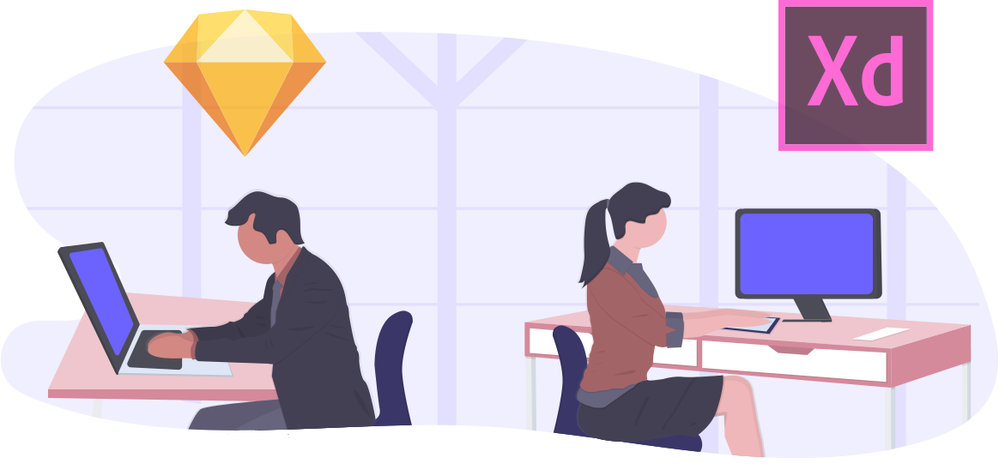

# デザインを言葉で伝える

!!! info "この章のゴール"
    「こういう見た目にしたい」を、AIに伝わる**言葉**で表せるようになること。
    雰囲気から**細かい部品・質感・動き**まで、用語ごとに**実物のミニ見本**を並べたので、「これに近い」を選んで頼むだけでOKです。

<figure markdown="span">
  { width="320" }
  <figcaption>「なんとなくおしゃれ」を、伝わる言葉に</figcaption>
</figure>

## なぜ「言葉」が大事？

**結論：AIは画面を“見て”いないので、雰囲気は言葉で伝える必要があります。**

**理由：** 「いい感じにして」だけだと、AIはどんな“いい感じ”か分かりません。
**「モダンで」「余白を広めに」「アクセントは青で」** のように、このページの言葉を添えると、ねらいに近づきます。

**具体例：**

```text
（×）おしゃれなトップ画面にして
（〇）モダンな雰囲気で、余白を広めに。アクセントカラーは青。
    上に大きめのヒーローを置いて、その下にカードを3つ並べて。
```

!!! warning "頼むときの注意"
    プロンプトに**実在の顧客名・案件名・社内システム名**などを書かないようにしましょう。
    見本やダミー名（`サンプル商店` など）で十分です。（→ [AIと安全に付き合う](ai-safety.md)）

<style>
/* === デザイン用語ミニ見本（このページ専用・dv- 接頭辞でスコープ）=== */
.dv-grid{display:flex;flex-wrap:wrap;gap:22px;margin:1.2em 0;}
.dv-item{width:240px;margin:0;}
.dv-item figcaption{font-size:.78rem;line-height:1.5;margin-top:.5em;color:var(--md-default-fg-color--light);}
.dv-item figcaption b{color:var(--md-default-fg-color);}
.dv-screen{width:240px;border-radius:11px;overflow:hidden;box-shadow:0 4px 16px rgba(0,0,0,.14);border:1px solid rgba(0,0,0,.08);background:#fff;font-family:system-ui,-apple-system,"Segoe UI",sans-serif;}
.dv-bar{height:22px;background:#f0f0f4;display:flex;align-items:center;gap:5px;padding:0 9px;}
.dv-bar i{width:8px;height:8px;border-radius:50%;background:#d2d2da;display:inline-block;}
.dv-page{padding:20px 18px;min-height:150px;display:flex;flex-direction:column;background:#fff;}
.dv-h{font-size:10px;font-weight:700;letter-spacing:.08em;margin-bottom:16px;color:#222;text-transform:uppercase;}
.dv-title{font-size:18px;font-weight:700;line-height:1.3;margin-bottom:9px;color:#1a1a1a;}
.dv-text{font-size:11px;color:#777;line-height:1.6;margin-bottom:16px;}
.dv-btn{align-self:flex-start;font-size:11px;padding:8px 16px;border-radius:7px;background:#333;color:#fff;font-weight:600;}

/* --- トーン別 --- */
.dv-modern .dv-btn{background:#4f46e5;border-radius:8px;}
.dv-modern .dv-h{color:#4f46e5;}

.dv-minimal .dv-page{background:#fff;}
.dv-minimal .dv-h{color:#999;font-weight:500;}
.dv-minimal .dv-title{font-weight:400;color:#111;letter-spacing:.02em;}
.dv-minimal .dv-btn{background:none;color:#111;border:1px solid #111;border-radius:0;font-weight:500;}

.dv-pop .dv-page{background:#fff7e6;}
.dv-pop .dv-h{color:#ff6f00;}
.dv-pop .dv-title{color:#ff3d81;}
.dv-pop .dv-btn{background:#ff3d81;border-radius:999px;font-weight:800;}

.dv-luxury .dv-bar{background:#23201c;}
.dv-luxury .dv-bar i{background:#544c3d;}
.dv-luxury .dv-page{background:#16130f;}
.dv-luxury .dv-h{color:#c9a96a;letter-spacing:.18em;}
.dv-luxury .dv-title{color:#ecdcb6;font-family:Georgia,"Times New Roman",serif;font-weight:500;}
.dv-luxury .dv-text{color:#a99c80;}
.dv-luxury .dv-btn{background:none;border:1px solid #c9a96a;color:#ecdcb6;border-radius:0;}

.dv-natural .dv-page{background:#f4efe4;}
.dv-natural .dv-h{color:#7c8a5f;}
.dv-natural .dv-title{color:#4c5a3a;}
.dv-natural .dv-text{color:#80795f;}
.dv-natural .dv-btn{background:#8a9a6b;border-radius:22px;}

.dv-retro .dv-page{background:#f6ead2;}
.dv-retro .dv-h{color:#b14a1f;letter-spacing:.1em;}
.dv-retro .dv-title{color:#c4561e;font-family:Georgia,serif;}
.dv-retro .dv-text{color:#8a6f4a;}
.dv-retro .dv-btn{background:#2e6068;border-radius:0;}

.dv-dark .dv-bar{background:#26262e;}
.dv-dark .dv-bar i{background:#444450;}
.dv-dark .dv-page{background:#1c1c22;}
.dv-dark .dv-h{color:#8b8bff;}
.dv-dark .dv-title{color:#f3f3f7;}
.dv-dark .dv-text{color:#9a9aa6;}
.dv-dark .dv-btn{background:#5b54f0;}

/* --- レイアウト用の部品 --- */
.dv-ly{padding:0;min-height:160px;}
.dv-block{background:#e3e3ee;border-radius:5px;}
.dv-accentblock{background:#4f46e5;}
.dv-hero{height:62px;background:linear-gradient(120deg,#5b54f0,#8b5cf6);display:flex;align-items:center;justify-content:center;color:#fff;font-size:12px;font-weight:700;}
.dv-pad{padding:12px;display:flex;flex-direction:column;gap:8px;}
.dv-row{display:flex;gap:8px;}
.dv-card{flex:1;height:46px;background:#eef0f7;border-radius:6px;border:1px solid #e0e2ee;}
.dv-line{height:8px;border-radius:4px;background:#e3e3ee;}
.dv-line.s{width:60%;}
.dv-cols{display:flex;height:160px;}
.dv-side{width:34%;background:#2b2b39;}
.dv-side .dv-line{background:#4a4a5e;margin:10px;}
.dv-main{flex:1;padding:12px;display:flex;flex-direction:column;gap:8px;}
.dv-gridcells{display:grid;grid-template-columns:1fr 1fr 1fr;gap:7px;padding:12px;}
.dv-cell{aspect-ratio:1;background:#eef0f7;border-radius:6px;border:1px solid #e0e2ee;}

/* --- 色 --- */
.dv-sw{display:flex;height:46px;border-radius:7px;overflow:hidden;margin-bottom:10px;}
.dv-sw span{flex:1;}
.dv-grad{height:46px;border-radius:7px;background:linear-gradient(120deg,#5b54f0,#ec4899);margin-bottom:10px;}

/* --- フォント比較 --- */
.dv-font{padding:18px;}
.dv-font .big{font-size:21px;font-weight:700;margin-bottom:4px;color:#1a1a1a;}
.dv-font .sml{font-size:11px;color:#777;}
.dv-gothic .big,.dv-gothic .sml{font-family:system-ui,"Hiragino Kaku Gothic ProN","Yu Gothic",sans-serif;}
.dv-mincho .big,.dv-mincho .sml{font-family:"Hiragino Mincho ProN","Yu Mincho",serif;}

/* --- ボタン見本 --- */
.dv-btns{padding:18px;display:flex;flex-direction:column;gap:11px;align-items:flex-start;}
.dv-b{font-size:11px;padding:8px 16px;font-weight:600;}
.dv-b.fill{background:#4f46e5;color:#fff;border-radius:7px;}
.dv-b.outline{background:none;color:#4f46e5;border:1px solid #4f46e5;border-radius:7px;}
.dv-b.pill{background:#4f46e5;color:#fff;border-radius:999px;}
.dv-b.square{background:#1a1a1a;color:#fff;border-radius:0;}

/* === 細かい指示の見本（追加分）=== */
/* --- A. UIパーツ --- */
.dv-ui{padding:0;min-height:160px;}
.dv-header{height:30px;background:#4f46e5;display:flex;align-items:center;justify-content:space-between;padding:0 12px;color:#fff;font-size:10px;font-weight:700;}
.dv-burger{display:flex;flex-direction:column;gap:3px;}
.dv-burger span{width:16px;height:2px;background:#fff;border-radius:2px;}
.dv-ui-body{padding:12px;display:flex;flex-direction:column;gap:8px;flex:1;}
.dv-footer{margin-top:auto;height:26px;background:#26262e;color:#9a9aa6;font-size:9px;display:flex;align-items:center;justify-content:center;}
.dv-modal-wrap{position:relative;flex:1;background:#eef0f7;display:flex;align-items:center;justify-content:center;}
.dv-modal-wrap::before{content:"";position:absolute;inset:0;background:rgba(0,0,0,.4);}
.dv-modal{position:relative;width:74%;background:#fff;border-radius:9px;box-shadow:0 8px 24px rgba(0,0,0,.3);padding:14px;text-align:center;}
.dv-modal .t{font-size:11px;font-weight:700;margin-bottom:7px;color:#222;}
.dv-modal .b{font-size:10px;padding:5px 13px;background:#4f46e5;color:#fff;border-radius:6px;display:inline-block;}
.dv-tabs{display:flex;border-bottom:2px solid #e3e3ee;}
.dv-tabs span{font-size:10px;padding:8px 11px;color:#999;}
.dv-tabs span.on{color:#4f46e5;border-bottom:2px solid #4f46e5;margin-bottom:-2px;font-weight:700;}
.dv-acc div{font-size:10px;padding:9px 12px;border-bottom:1px solid #eee;display:flex;justify-content:space-between;color:#333;}
.dv-acc .open{background:#f5f6fc;font-weight:700;color:#4f46e5;}
.dv-form{padding:14px;display:flex;flex-direction:column;gap:8px;}
.dv-lbl{font-size:9px;color:#888;}
.dv-input{height:22px;border:1px solid #ccc;border-radius:5px;background:#fff;}
.dv-toggle{width:34px;height:18px;background:#4f46e5;border-radius:999px;position:relative;}
.dv-toggle::after{content:"";position:absolute;top:2px;right:2px;width:14px;height:14px;background:#fff;border-radius:50%;}
.dv-toggle.off{background:#ccc;}
.dv-toggle.off::after{right:auto;left:2px;}
.dv-crumb{font-size:9px;color:#999;}
.dv-crumb b{color:#4f46e5;}
.dv-badge{background:#ff3d81;color:#fff;font-size:8px;border-radius:999px;padding:1px 6px;font-weight:700;}

/* --- B. 質感・エフェクト --- */
.dv-fx{padding:18px;display:flex;gap:16px;align-items:center;justify-content:center;min-height:150px;flex-wrap:wrap;}
.dv-box{width:60px;height:60px;background:#fff;border-radius:10px;}
.dv-box.flat{box-shadow:none;border:1px solid #e2e2ea;}
.dv-box.shadow{box-shadow:0 7px 18px rgba(0,0,0,.24);}
.dv-box.r0{border-radius:0;border:1px solid #ddd;background:#4f46e5;}
.dv-box.rbig{border-radius:22px;background:#4f46e5;}
.dv-box.bd{background:none;border:2px solid #4f46e5;}
.dv-glass-page{background:linear-gradient(135deg,#5b54f0,#ec4899);align-items:center;justify-content:center;}
.dv-glass{background:rgba(255,255,255,.22);backdrop-filter:blur(7px);-webkit-backdrop-filter:blur(7px);border:1px solid rgba(255,255,255,.45);border-radius:13px;width:75%;height:78px;}

/* --- C. 動き --- */
.dv-motion{padding:20px;display:flex;flex-direction:column;gap:14px;align-items:center;justify-content:center;min-height:150px;}
.dv-hoverbtn,.dv-pressbtn{font-size:11px;padding:9px 18px;background:#4f46e5;color:#fff;border-radius:8px;cursor:pointer;font-weight:600;}
.dv-hoverbtn{transition:.25s;}
.dv-hoverbtn:hover{background:#ec4899;transform:translateY(-2px);box-shadow:0 7px 16px rgba(0,0,0,.25);}
.dv-pressbtn{transition:.08s;}
.dv-pressbtn:active{transform:scale(.9);background:#3d35c9;}
@keyframes dvfade{0%{opacity:0;transform:translateY(12px);}50%{opacity:1;transform:none;}100%{opacity:1;transform:none;}}
.dv-fadebox{animation:dvfade 2.6s ease-in-out infinite;background:#4f46e5;color:#fff;font-size:11px;padding:13px 20px;border-radius:8px;font-weight:600;}

/* --- D. 配置・間隔 --- */
.dv-align{padding:16px;display:flex;flex-direction:column;gap:9px;}
.dv-align .ln{height:9px;background:#dcdce8;border-radius:4px;width:72%;}
.dv-align .ln.s{width:48%;}
.dv-align.center .ln{margin:0 auto;}
.dv-align.right .ln{margin-left:auto;}
.dv-lh{padding:14px;font-size:10px;color:#555;}
.dv-lh.tight{line-height:1.2;}
.dv-lh.loose{line-height:2.2;}

/* --- E. 配色ニュアンス --- */
.dv-tone{display:flex;height:54px;border-radius:8px;overflow:hidden;margin:8px 0;}
.dv-tone span{flex:1;}

/* --- F. レスポンシブ --- */
.dv-phone{width:118px;margin:0 auto;border:7px solid #26262e;border-top-width:14px;border-bottom-width:14px;border-radius:20px;overflow:hidden;background:#fff;}
.dv-phone .dv-pad{padding:10px;}
</style>

## 1. 全体の雰囲気・トーン

**同じ内容でも、トーンを変えるだけで印象がこんなに変わります**（下はすべて同じ「お店のトップ」の見本）。

<div class="dv-grid" markdown="0">

<figure class="dv-item">
  <div class="dv-screen dv-modern"><div class="dv-bar"><i></i><i></i><i></i></div>
  <div class="dv-page"><div class="dv-h">Shop</div><div class="dv-title">あたらしい毎日を。</div><div class="dv-text">シンプルで使いやすい道具たち。</div><div class="dv-btn">見てみる</div></div></div>
  <figcaption><b>モダン</b><br>余白広め・無彩色＋1色・角丸ひかえめ。今っぽく洗練。</figcaption>
</figure>

<figure class="dv-item">
  <div class="dv-screen dv-minimal"><div class="dv-bar"><i></i><i></i><i></i></div>
  <div class="dv-page"><div class="dv-h">Shop</div><div class="dv-title">あたらしい毎日を。</div><div class="dv-text">シンプルで使いやすい道具たち。</div><div class="dv-btn">見てみる</div></div></div>
  <figcaption><b>ミニマル</b><br>色も飾りも極限まで削る。線は細く、白が主役。</figcaption>
</figure>

<figure class="dv-item">
  <div class="dv-screen dv-pop"><div class="dv-bar"><i></i><i></i><i></i></div>
  <div class="dv-page"><div class="dv-h">Shop</div><div class="dv-title">あたらしい毎日を！</div><div class="dv-text">シンプルで使いやすい道具たち。</div><div class="dv-btn">見てみる</div></div></div>
  <figcaption><b>ポップ</b><br>明るい色・丸み・元気。親しみやすく楽しい印象。</figcaption>
</figure>

<figure class="dv-item">
  <div class="dv-screen dv-luxury"><div class="dv-bar"><i></i><i></i><i></i></div>
  <div class="dv-page"><div class="dv-h">SHOP</div><div class="dv-title">あたらしい毎日を。</div><div class="dv-text">シンプルで使いやすい道具たち。</div><div class="dv-btn">見てみる</div></div></div>
  <figcaption><b>高級感／ラグジュアリー</b><br>暗い背景＋金・明朝。余白たっぷりで上質に。</figcaption>
</figure>

<figure class="dv-item">
  <div class="dv-screen dv-natural"><div class="dv-bar"><i></i><i></i><i></i></div>
  <div class="dv-page"><div class="dv-h">Shop</div><div class="dv-title">あたらしい毎日を。</div><div class="dv-text">シンプルで使いやすい道具たち。</div><div class="dv-btn">見てみる</div></div></div>
  <figcaption><b>ナチュラル</b><br>ベージュ・緑などの自然色。やわらかく落ち着く。</figcaption>
</figure>

<figure class="dv-item">
  <div class="dv-screen dv-retro"><div class="dv-bar"><i></i><i></i><i></i></div>
  <div class="dv-page"><div class="dv-h">SHOP</div><div class="dv-title">あたらしい毎日を。</div><div class="dv-text">シンプルで使いやすい道具たち。</div><div class="dv-btn">見てみる</div></div></div>
  <figcaption><b>レトロ</b><br>くすんだ色・昔っぽい配色。懐かしい雰囲気。</figcaption>
</figure>

<figure class="dv-item">
  <div class="dv-screen dv-dark"><div class="dv-bar"><i></i><i></i><i></i></div>
  <div class="dv-page"><div class="dv-h">Shop</div><div class="dv-title">あたらしい毎日を。</div><div class="dv-text">シンプルで使いやすい道具たち。</div><div class="dv-btn">見てみる</div></div></div>
  <figcaption><b>ダーク（ダークモード）</b><br>暗い背景＋明るい文字。目に優しく今っぽい。</figcaption>
</figure>

</div>

| 言葉 | こんな印象 | こう頼む |
|---|---|---|
| **モダン** | 洗練・今っぽい・すっきり | `モダンな雰囲気で` |
| **ミニマル** | 必要最小限・静か | `ミニマルに、要素を減らして` |
| **ポップ** | 明るい・楽しい・親しみ | `ポップで明るい感じ` |
| **高級感／ラグジュアリー** | 上質・落ち着き | `高級感のある雰囲気で` |
| **ナチュラル** | やわらかい・自然 | `ナチュラルで温かみのある色で` |
| **レトロ** | 懐かしい・味がある | `レトロな配色で` |
| **ダーク** | かっこいい・目に優しい | `ダークモードの配色で` |

## 2. レイアウト・構成

**画面のどこに何を置くか**を表す言葉です。「上にヒーロー、その下にカード3つ」のように組み合わせて伝えます。

<div class="dv-grid" markdown="0">

<figure class="dv-item">
  <div class="dv-screen"><div class="dv-bar"><i></i><i></i><i></i></div>
  <div class="dv-page dv-ly"><div class="dv-hero">大きな見出し</div><div class="dv-pad"><div class="dv-line"></div><div class="dv-line s"></div></div></div></div>
  <figcaption><b>ヒーロー</b><br>画面上部の大きな見せ場（写真や見出し）。</figcaption>
</figure>

<figure class="dv-item">
  <div class="dv-screen"><div class="dv-bar"><i></i><i></i><i></i></div>
  <div class="dv-page dv-ly"><div class="dv-pad"><div class="dv-row"><div class="dv-card"></div><div class="dv-card"></div><div class="dv-card"></div></div><div class="dv-row"><div class="dv-card"></div><div class="dv-card"></div><div class="dv-card"></div></div></div></div></div>
  <figcaption><b>カード</b><br>情報を四角いパネルに分けて並べる。</figcaption>
</figure>

<figure class="dv-item">
  <div class="dv-screen"><div class="dv-bar"><i></i><i></i><i></i></div>
  <div class="dv-page dv-ly"><div class="dv-gridcells"><div class="dv-cell"></div><div class="dv-cell"></div><div class="dv-cell"></div><div class="dv-cell"></div><div class="dv-cell"></div><div class="dv-cell"></div></div></div></div>
  <figcaption><b>グリッド</b><br>格子状に整然と並べる（写真一覧など）。</figcaption>
</figure>

<figure class="dv-item">
  <div class="dv-screen"><div class="dv-bar"><i></i><i></i><i></i></div>
  <div class="dv-page dv-ly"><div class="dv-cols"><div class="dv-side"><div class="dv-line"></div><div class="dv-line"></div><div class="dv-line s"></div></div><div class="dv-main"><div class="dv-line"></div><div class="dv-line s"></div><div class="dv-card" style="height:60px;"></div></div></div></div></div>
  <figcaption><b>サイドバー</b><br>横にメニュー列、残りが本文。管理画面に多い。</figcaption>
</figure>

</div>

| 言葉 | 意味 | こう頼む |
|---|---|---|
| **ヒーロー** | 上部の大きな見せ場 | `上に大きめのヒーローを置いて` |
| **カード** | 四角いパネルで区切る | `項目はカードで並べて` |
| **グリッド** | 格子状に整列 | `写真はグリッドで並べて` |
| **サイドバー** | 横のメニュー列 | `左にサイドバーメニューを` |
| **余白（ホワイトスペース）** | あえて空ける空間 | `余白を広めにとって、ゆったり` |

## 3. 色・配色

<div class="dv-grid" markdown="0">

<figure class="dv-item">
  <div class="dv-screen"><div class="dv-bar"><i></i><i></i><i></i></div>
  <div class="dv-page"><div class="dv-line"></div><div class="dv-line s" style="margin-top:8px;margin-bottom:16px;"></div><div class="dv-btn" style="background:#4f46e5;">これだけ色</div></div></div>
  <figcaption><b>アクセントカラー</b><br>全体は無彩色、要所だけ1色効かせる。</figcaption>
</figure>

<figure class="dv-item">
  <div class="dv-screen"><div class="dv-bar"><i></i><i></i><i></i></div>
  <div class="dv-page"><div class="dv-sw"><span style="background:#1a1a1a;"></span><span style="background:#5a5a5a;"></span><span style="background:#9a9a9a;"></span><span style="background:#d8d8d8;"></span></div><div class="dv-line"></div><div class="dv-line s" style="margin-top:8px;"></div></div></div>
  <figcaption><b>モノトーン</b><br>白〜黒の濃淡だけ。落ち着いて締まる。</figcaption>
</figure>

<figure class="dv-item">
  <div class="dv-screen"><div class="dv-bar"><i></i><i></i><i></i></div>
  <div class="dv-page"><div class="dv-grad"></div><div class="dv-line"></div><div class="dv-line s" style="margin-top:8px;"></div></div></div>
  <figcaption><b>グラデーション</b><br>色をなめらかに変化。今っぽく華やか。</figcaption>
</figure>

<figure class="dv-item">
  <div class="dv-screen"><div class="dv-bar"><i></i><i></i><i></i></div>
  <div class="dv-page" style="background:#111;"><div class="dv-title" style="color:#fff;">くっきり読める</div><div class="dv-text" style="color:#888;">背景と文字の明暗差が大きい状態。</div></div></div>
  <figcaption><b>コントラスト</b><br>明暗の差。大きいほど読みやすく目立つ。</figcaption>
</figure>

</div>

| 言葉 | 意味 | こう頼む |
|---|---|---|
| **アクセントカラー** | 要所に効かせる1色 | `アクセントカラーは青で` |
| **メインカラー／ベースカラー** | 全体の基調色／背景色 | `ベースは白、メインは紺で` |
| **モノトーン** | 白黒グレーだけ | `モノトーンでまとめて` |
| **グラデーション** | 色のなめらかな変化 | `見出しは青〜紫のグラデで` |
| **コントラスト** | 明暗・色の差 | `コントラスト高めで読みやすく` |

!!! tip "色は「名前」か「色コード」で"
    `青` のような言葉でも、`#1E88E5` のような**色コード（カラーコード）**でも伝えられます。
    ブランド色が決まっているなら、色コードを渡すと正確です。

## 4. 文字・フォント・部品

### 文字（フォント）の系統

<div class="dv-grid" markdown="0">

<figure class="dv-item">
  <div class="dv-screen"><div class="dv-bar"><i></i><i></i><i></i></div>
  <div class="dv-page dv-font dv-gothic"><div class="big">あたらしい毎日</div><div class="sml">線の太さが均一で、すっきり読みやすい。</div></div></div>
  <figcaption><b>ゴシック体（サンセリフ）</b><br>線が均一。現代的で画面向き。迷ったらこれ。</figcaption>
</figure>

<figure class="dv-item">
  <div class="dv-screen"><div class="dv-bar"><i></i><i></i><i></i></div>
  <div class="dv-page dv-font dv-mincho"><div class="big">あたらしい毎日</div><div class="sml">はらい・はねがあり、上品で落ち着く。</div></div></div>
  <figcaption><b>明朝体（セリフ）</b><br>線に強弱。上品・伝統的・読み物向き。</figcaption>
</figure>

</div>

### ボタンの形

<div class="dv-grid" markdown="0">

<figure class="dv-item">
  <div class="dv-screen"><div class="dv-bar"><i></i><i></i><i></i></div>
  <div class="dv-page dv-btns"><span class="dv-b fill">塗り（ベタ）</span><span class="dv-b outline">枠線だけ</span><span class="dv-b pill">角丸（ピル）</span><span class="dv-b square">角ばり</span></div></div>
  <figcaption><b>ボタンの種類</b><br>「塗り／枠線だけ／角丸／角ばり」で印象が変わる。</figcaption>
</figure>

</div>

| 言葉 | 意味 | こう頼む |
|---|---|---|
| **ゴシック体／サンセリフ** | 線が均一な文字 | `見出しはゴシックで` |
| **明朝体／セリフ** | 線に強弱がある文字 | `本文は明朝で上品に` |
| **塗りボタン** | 中まで色がある | `ボタンは塗りで目立たせて` |
| **枠線（アウトライン）ボタン** | 枠だけ | `サブのボタンは枠線だけで` |
| **角丸／ピル** | 角を丸める | `ボタンは角丸（ピル型）で` |
| **ナビ（ナビゲーション）** | 画面上の案内メニュー | `上にナビメニューを置いて` |

---

## 5. UIパーツの名前

「ここにこれを置いて」と頼むときに使う、**部品の呼び名**です。名前で言えると一発で伝わります。

<div class="dv-grid" markdown="0">

<figure class="dv-item">
  <div class="dv-screen"><div class="dv-bar"><i></i><i></i><i></i></div>
  <div class="dv-page dv-ui"><div class="dv-header">サンプル商店<span class="dv-burger"><span></span><span></span><span></span></span></div><div class="dv-ui-body"><div class="dv-line"></div><div class="dv-line s"></div></div><div class="dv-footer">© Sample</div></div></div>
  <figcaption><b>ヘッダー／フッター／ハンバーガー</b><br>上の帯＝ヘッダー、下＝フッター、三本線＝ハンバーガーメニュー。</figcaption>
</figure>

<figure class="dv-item">
  <div class="dv-screen"><div class="dv-bar"><i></i><i></i><i></i></div>
  <div class="dv-page dv-ui"><div class="dv-modal-wrap"><div class="dv-modal"><div class="t">削除しますか？</div><span class="b">OK</span></div></div></div></div>
  <figcaption><b>モーダル（ポップアップ）</b><br>画面の手前に重ねて出す確認・入力の小窓。</figcaption>
</figure>

<figure class="dv-item">
  <div class="dv-screen"><div class="dv-bar"><i></i><i></i><i></i></div>
  <div class="dv-page dv-ui"><div class="dv-tabs"><span class="on">概要</span><span>詳細</span><span>口コミ</span></div><div class="dv-ui-body"><div class="dv-line"></div><div class="dv-line s"></div></div></div></div>
  <figcaption><b>タブ</b><br>見出しを切り替えて、同じ場所に中身を出し分ける。</figcaption>
</figure>

<figure class="dv-item">
  <div class="dv-screen"><div class="dv-bar"><i></i><i></i><i></i></div>
  <div class="dv-page dv-ui"><div class="dv-acc"><div class="open">配送について <span>−</span></div><div>支払い方法 <span>＋</span></div><div>返品について <span>＋</span></div></div></div></div>
  <figcaption><b>アコーディオン</b><br>クリックで開閉する折りたたみ（よくあるQ&Aなど）。</figcaption>
</figure>

<figure class="dv-item">
  <div class="dv-screen"><div class="dv-bar"><i></i><i></i><i></i></div>
  <div class="dv-page dv-form"><div class="dv-lbl">お名前</div><div class="dv-input"></div><div class="dv-lbl">メール</div><div class="dv-input"></div><span class="dv-b fill" style="margin-top:4px;">送信</span></div></div>
  <figcaption><b>フォーム（入力欄）</b><br>名前やメールなどを入力してもらう枠。</figcaption>
</figure>

<figure class="dv-item">
  <div class="dv-screen"><div class="dv-bar"><i></i><i></i><i></i></div>
  <div class="dv-page" style="gap:14px;"><div class="dv-crumb">ホーム ＞ 商品 ＞ <b>くつ</b></div><div style="display:flex;align-items:center;gap:8px;font-size:11px;">通知 <span class="dv-badge">3</span></div><div style="display:flex;align-items:center;gap:8px;font-size:11px;">メール通知 <span class="dv-toggle"></span></div><div style="display:flex;align-items:center;gap:8px;font-size:11px;">公開する <span class="dv-toggle off"></span></div></div></div>
  <figcaption><b>パンくず／バッジ／トグル</b><br>現在地の道しるべ・件数の印・オンオフのスイッチ。</figcaption>
</figure>

</div>

| 言葉 | 何のこと | こう頼む |
|---|---|---|
| **ヘッダー／フッター** | 画面の上の帯／下の帯 | `ヘッダーにロゴ、フッターに会社情報を` |
| **ハンバーガーメニュー** | 三本線の開閉メニュー | `スマホでは右上にハンバーガーメニューを` |
| **モーダル／ポップアップ** | 手前に重ねて出す小窓 | `削除の確認はモーダルで出して` |
| **タブ** | 切り替えて出し分け | `情報はタブで「概要／詳細」に分けて` |
| **アコーディオン** | 開閉する折りたたみ | `Q&Aはアコーディオンにして` |
| **フォーム** | 入力欄のまとまり | `問い合わせフォームを付けて` |
| **ドロップダウン** | 押すと候補が下に出る | `都道府県はドロップダウンで選ばせて` |
| **カルーセル／スライダー** | 横スクロールの切替表示 | `写真はカルーセルで` |
| **トグル（スイッチ）** | オンオフの切替 | `通知の設定はトグルで` |
| **バッジ** | 件数・状態の小さな印 | `未読件数をバッジで` |
| **パンくず** | 現在地の道しるべ | `上にパンくずリストを` |
| **ツールチップ** | 乗せると出る小さな説明 | `アイコンにツールチップで説明を` |

---

## 6. 質感・エフェクト

「ぺたっと平面」か「ふっくら立体」か――**手ざわりの印象**を決める言葉です。

<div class="dv-grid" markdown="0">

<figure class="dv-item">
  <div class="dv-screen"><div class="dv-bar"><i></i><i></i><i></i></div>
  <div class="dv-page dv-fx"><div class="dv-box flat"></div><div class="dv-box shadow"></div></div></div>
  <figcaption><b>フラット ⇔ 影（立体）</b><br>左：影なしで平面的／右：影をつけて浮き上がる。</figcaption>
</figure>

<figure class="dv-item">
  <div class="dv-screen"><div class="dv-bar"><i></i><i></i><i></i></div>
  <div class="dv-page dv-fx"><div class="dv-box r0"></div><div class="dv-box rbig"></div></div></div>
  <figcaption><b>角丸の強さ</b><br>左：角ばり（カチッと）／右：角丸大（やわらかい）。</figcaption>
</figure>

<figure class="dv-item">
  <div class="dv-screen"><div class="dv-bar"><i></i><i></i><i></i></div>
  <div class="dv-page dv-fx dv-glass-page"><div class="dv-glass"></div></div></div>
  <figcaption><b>すりガラス（半透明・ぼかし）</b><br>背景が透けてぼやける、今っぽい質感。</figcaption>
</figure>

<figure class="dv-item">
  <div class="dv-screen"><div class="dv-bar"><i></i><i></i><i></i></div>
  <div class="dv-page dv-fx"><div class="dv-box bd"></div></div></div>
  <figcaption><b>枠線（ボーダー）だけ</b><br>塗らずに線で囲う。軽く・控えめな印象。</figcaption>
</figure>

</div>

| 言葉 | 意味 | こう頼む |
|---|---|---|
| **フラット** | 影や立体感のない平面 | `フラットなデザインで` |
| **影（ドロップシャドウ）** | 浮き上がって見える影 | `カードに軽く影をつけて` |
| **角丸（border-radius）** | 角の丸み | `角は大きめに丸めて` |
| **すりガラス（半透明＋ぼかし）** | 背景が透けてぼける質感 | `ヘッダーはすりガラス風で` |
| **枠線（ボーダー）** | 囲う線 | `ボタンは枠線だけで` |
| **透明感・透け** | 半透明にする | `背景をうっすら透けさせて` |

---

## 7. 動き（アニメーション）

動きは静止画では伝わりません。**下の見本はマウスを乗せたり押したりすると実際に動きます**（スマホはタップ）。

<div class="dv-grid" markdown="0">

<figure class="dv-item">
  <div class="dv-screen"><div class="dv-bar"><i></i><i></i><i></i></div>
  <div class="dv-page dv-motion"><span class="dv-hoverbtn">乗せてみて</span></div></div>
  <figcaption><b>ホバー（マウスを乗せたとき）</b><br>乗せると色や位置が変わる。「押せる」と伝わる。</figcaption>
</figure>

<figure class="dv-item">
  <div class="dv-screen"><div class="dv-bar"><i></i><i></i><i></i></div>
  <div class="dv-page dv-motion"><span class="dv-pressbtn">押してみて</span></div></div>
  <figcaption><b>押したときの反応（クリック）</b><br>押すときゅっと縮む。反応があると安心感が出る。</figcaption>
</figure>

<figure class="dv-item">
  <div class="dv-screen"><div class="dv-bar"><i></i><i></i><i></i></div>
  <div class="dv-page dv-motion"><span class="dv-fadebox">ふわっと表示</span></div></div>
  <figcaption><b>フェードイン（ふわっと出る）</b><br>下からふわっと現れる。やわらかい登場演出。</figcaption>
</figure>

</div>

| 言葉 | 意味 | こう頼む |
|---|---|---|
| **ホバー** | マウスを乗せたときの変化 | `ボタンはホバーで色が変わるように` |
| **フェードイン** | じわっと現れる | `見出しはフェードインで表示して` |
| **スクロール連動** | スクロールで出てくる | `下にスクロールすると順番に出てくるように` |
| **クリック／タップの反応** | 押したときの手応え | `押したら少し沈む反応を付けて` |

!!! tip "動きは控えめが基本"
    動きは多すぎると読みづらく・うるさくなります。「**さりげなく**」「**ゆっくりめ**」と添えると上品になります。

---

## 8. 配置・配色のニュアンス・スマホ対応

### 配置・間隔

<div class="dv-grid" markdown="0">

<figure class="dv-item">
  <div class="dv-screen"><div class="dv-bar"><i></i><i></i><i></i></div>
  <div class="dv-page dv-align"><div class="ln"></div><div class="ln s"></div><div class="ln"></div></div></div>
  <figcaption><b>左寄せ</b><br>標準。文章はこれが読みやすい。</figcaption>
</figure>

<figure class="dv-item">
  <div class="dv-screen"><div class="dv-bar"><i></i><i></i><i></i></div>
  <div class="dv-page dv-align center"><div class="ln"></div><div class="ln s"></div><div class="ln"></div></div></div>
  <figcaption><b>中央寄せ</b><br>見出しやトップ画面で印象的に。</figcaption>
</figure>

<figure class="dv-item">
  <div class="dv-screen"><div class="dv-bar"><i></i><i></i><i></i></div>
  <div class="dv-page" style="padding:0;"><div class="dv-lh tight">行間つめ。みっちり詰まって情報量が多い印象になります。読み物には少し窮屈。</div><hr style="margin:0;border:none;border-top:1px solid #eee;"><div class="dv-lh loose">行間ゆったり。ゆとりがあって、上品で読みやすい印象になります。</div></div></div>
  <figcaption><b>行間（詰める ⇔ ゆったり）</b><br>行の間隔。広いほど上品・ゆったり。</figcaption>
</figure>

</div>

### 配色のニュアンス

<div class="dv-grid" markdown="0">

<figure class="dv-item">
  <div class="dv-screen"><div class="dv-bar"><i></i><i></i><i></i></div>
  <div class="dv-page"><div class="dv-tone"><span style="background:#ffd1dc;"></span><span style="background:#cde7ff;"></span><span style="background:#d7f0d5;"></span><span style="background:#fff4c2;"></span></div><div class="dv-text" style="margin:0;">やさしく軽い印象。</div></div></div>
  <figcaption><b>パステル</b><br>白っぽく淡い色。やわらかい・かわいい。</figcaption>
</figure>

<figure class="dv-item">
  <div class="dv-screen"><div class="dv-bar"><i></i><i></i><i></i></div>
  <div class="dv-page"><div class="dv-tone"><span style="background:#ff1744;"></span><span style="background:#2979ff;"></span><span style="background:#00e676;"></span><span style="background:#ffea00;"></span></div><div class="dv-text" style="margin:0;">元気で目立つ印象。</div></div></div>
  <figcaption><b>ビビッド</b><br>鮮やかで強い色。元気・目立つ。</figcaption>
</figure>

<figure class="dv-item">
  <div class="dv-screen"><div class="dv-bar"><i></i><i></i><i></i></div>
  <div class="dv-page"><div class="dv-tone"><span style="background:#c8a9a0;"></span><span style="background:#a3b1ad;"></span><span style="background:#cabf9e;"></span><span style="background:#9aa3b0;"></span></div><div class="dv-text" style="margin:0;">落ち着いた大人の印象。</div></div></div>
  <figcaption><b>くすみ（ニュアンスカラー）</b><br>少し濁った色。おしゃれ・落ち着く。</figcaption>
</figure>

</div>

### スマホ対応（レスポンシブ）

<div class="dv-grid" markdown="0">

<figure class="dv-item" style="width:240px;">
  <div class="dv-screen"><div class="dv-bar"><i></i><i></i><i></i></div>
  <div class="dv-page dv-ly"><div class="dv-pad"><div class="dv-row"><div class="dv-card"></div><div class="dv-card"></div><div class="dv-card"></div></div></div></div></div>
  <figcaption><b>PC（横に広い）</b><br>カードを横3つに並べる。</figcaption>
</figure>

<figure class="dv-item" style="width:140px;">
  <div class="dv-phone"><div class="dv-bar"><i></i><i></i><i></i></div>
  <div class="dv-page dv-ly"><div class="dv-pad"><div class="dv-card" style="height:34px;"></div><div class="dv-card" style="height:34px;"></div><div class="dv-card" style="height:34px;"></div></div></div></div>
  <figcaption><b>スマホ（細い）</b><br>同じ内容が縦に積み替わる。</figcaption>
</figure>

</div>

| 言葉 | 意味 | こう頼む |
|---|---|---|
| **中央寄せ／左寄せ／右寄せ** | 文字や要素の揃え位置 | `見出しは中央寄せ、本文は左寄せ` |
| **行間（ゆったり／詰める）** | 行と行の間隔 | `行間は広めにゆったりと` |
| **余白を詰める／広げる** | 要素まわりの空き | `全体的に余白を広げて` |
| **パステル** | 淡くやわらかい色 | `パステル調でやさしく` |
| **ビビッド** | 鮮やかで強い色 | `差し色はビビッドに` |
| **くすみ（ニュアンス）カラー** | 少し濁った落ち着いた色 | `全体はくすみカラーで` |
| **レスポンシブ** | 画面幅に合わせて並び替え | `スマホでも崩れないレスポンシブで` |

---

## 組み合わせて頼んでみる

言葉は**重ねるほど**ねらいに近づきます。

```text
ナチュラルな雰囲気のカフェのトップ画面を作って。
・上に大きめのヒーロー（お店の名前と一言）
・その下にメニューをカードで3つ
・ベースはベージュ、アクセントは深い緑
・見出しは明朝、ボタンは角丸
・余白は広めでゆったり
```

!!! tip "見本があるならそれが最速"
    「このサイトみたいにして」と、参考にしたいページの**URLやスクショ**を渡すのも有効です。
    そのうえで「ここの色だけ変えて」と言葉を足すと、より思い通りになります。

!!! warning "参考画像をそのまま使わない"
    気に入ったサイトの**画像やロゴをそのまま使う**のは、著作権・ライセンス上の問題になることがあります。
    「**雰囲気を参考に、中身は自分のものを作る**」のが安全です。

## この章のまとめ

- [x] 雰囲気は「モダン・ミニマル」などの**トーンの言葉**で伝えられる
- [x] 「ヒーロー・カード・サイドバー」など**レイアウトの言葉**が分かった
- [x] 色は**言葉か色コード**で、アクセント／コントラストを指定できる
- [x] **UIパーツ名・質感・動き・配置**で、細かく指示できる
- [x] プロンプトに**実在の顧客名・機密**は書かない

!!! success "次のステップ"
    言葉がそろったら、実際に作ってみましょう。
    👉 [AIで作ってみる（ハンズオン）](ai-build.md)
