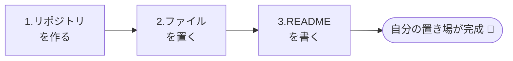

# 最初の一歩（リポジトリを作る）

!!! info "この章のゴール"
    自分のファイル置き場（**リポジトリ＝repo**）を作り、ファイルを置けるようになること。

<figure markdown="span">
  { width="320" }
  <figcaption>まずは「ファイルを入れる箱」を1つ用意します</figcaption>
</figure>

このページから、操作を **「🤖 Claudeに頼む」** と **「🖱️ 自分で操作」** の2通りで並べます。やりやすい方を選んでください。



---

## 1. リポジトリ（repo）を作る

「○○プロジェクト」のような名前で、ファイルを入れる箱を1つ作ります。

=== ":material-robot-happy-outline: Claudeに頼む"

    VSCodeでClaudeにこんなふうにお願いします。

    ```text
    GitHubに「my-first-repo」という名前で新しいリポジトリを作って。
    READMEファイルも付けて、最初は自分だけが見られる設定にして。
    ```

    Claudeが手順を進め、確認が必要なところは聞いてくれます。
    指示どおり進めれば、リポジトリができあがります。

=== ":material-cursor-default-click-outline: 自分で操作（GitHubサイト）"

    1. [github.com](https://github.com) にログイン
    2. 右上の **＋** → **New repository** を押す
    3. **Repository name** に名前を入れる（例：`my-first-repo`）
    4. 公開範囲を選ぶ（迷ったら **Private＝自分だけ**）
    5. **Add a README file** にチェックを入れる
    6. **Create repository** を押す

    !!! quote "📷 画面キャプチャ枠（あとで差し込み）"
        New repository の入力画面を入れます。
        `{ width="700" }`

!!! tip "Public と Private"
    - **Private（プライベート）** … 自分（と招待した人）だけが見られる
    - **Public（パブリック）** … インターネット全体に公開される

    最初の練習なら **Private** がおすすめです。

---

## 2. ファイルを置いてみる

作った箱に、ためしにファイルを1つ入れてみましょう。

=== ":material-robot-happy-outline: Claudeに頼む"

    ```text
    さっき作った my-first-repo に、
    「メモ.txt」というファイルを作って、中に「はじめてのファイルです」と書いて。
    そのままGitHubに反映して。
    ```

    「ファイル作成 → 記録（コミット）→ アップロード（プッシュ）」まで、まとめてお願いできます。
    （コミット・プッシュは次章でくわしく説明します）

=== ":material-cursor-default-click-outline: 自分で操作（GitHubサイト）"

    1. リポジトリの画面で **Add file** → **Create new file** を押す
    2. 上のほうにファイル名を入れる（例：`メモ.txt`）
    3. 本文に好きな文章を書く（例：`はじめてのファイルです`）
    4. ページ下の **Commit changes**（緑のボタン）を押す

    !!! quote "📷 画面キャプチャ枠（あとで差し込み）"
        Create new file の画面を入れます。
        `{ width="700" }`

---

## 3. READMEを書いてみる

**README（リードミー）** は、リポジトリの「表紙・説明書」です。
「このリポジトリは何のためのものか」を書いておくと、自分も他の人も後で分かりやすくなります。

=== ":material-robot-happy-outline: Claudeに頼む"

    ```text
    my-first-repo のREADMEに、
    「これはGitHubの練習用リポジトリです」という説明と、
    自分の名前（ニックネームでOK）を見出し付きで書いて。
    ```

=== ":material-cursor-default-click-outline: 自分で操作（GitHubサイト）"

    1. リポジトリ内の **README.md** を開く
    2. 右上の **鉛筆アイコン（Edit）** を押す
    3. 次のように書いてみる

        ```markdown
        # 練習用リポジトリ

        これはGitHubの練習用リポジトリです。
        ```

    4. **Commit changes** で保存

!!! note "Markdown（マークダウン）って？"
    `#` で見出し、`-` で箇条書きにできる、かんたんな書き方のルールです。
    少しずつ覚えれば大丈夫。まずは `#` と文章だけでも十分です。

---

## この章のまとめ

- [x] リポジトリ（repo）を作った
- [x] ファイルを置いた
- [x] READMEを書いた

!!! success "次のステップ"
    置き場ができました。次は、ファイルを変更して **その変更を記録（コミット）** する流れを覚えましょう。

    👉 [変更を記録する（コミット）](commit-push.md)
