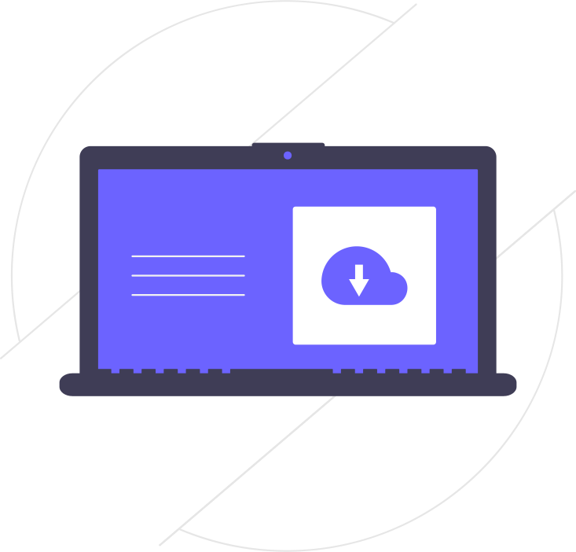
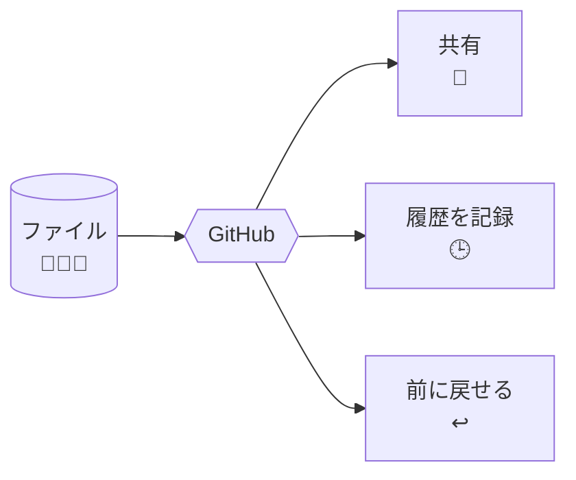
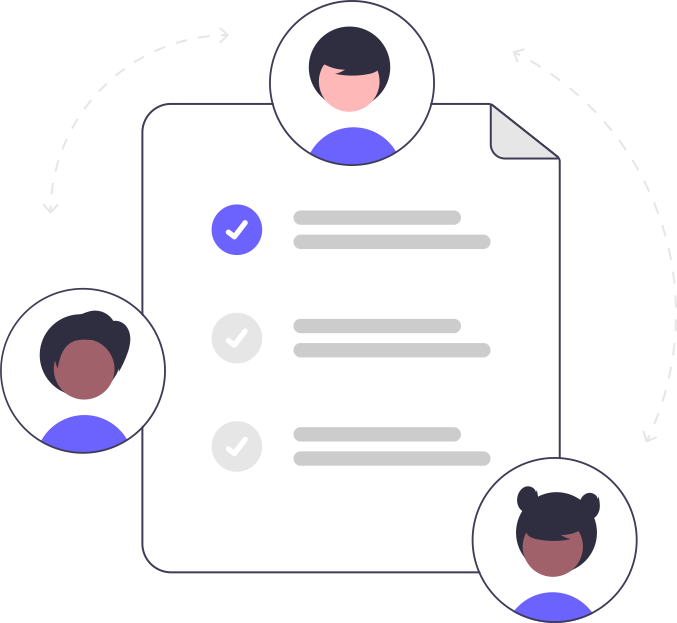
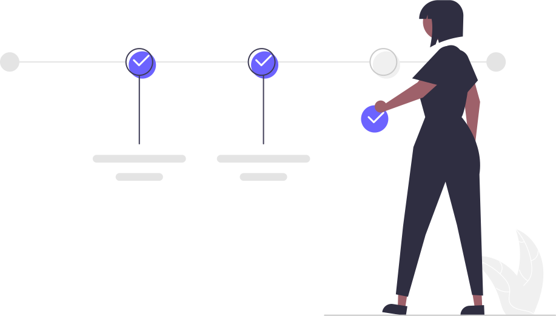

# はじめに

<figure markdown="span">
  { width="360" }
  <figcaption>GitHubの世界へ、ようこそ 👋</figcaption>
</figure>

このサイトは、**GitHub（ギットハブ）をはじめて使う方**のための入門ガイドです。
専門用語はできるだけかみくだいて説明します。順番に読み進めれば、ひとりでも基本操作ができるようになります。

!!! tip "読み方のおすすめ"
    まずはこの「はじめに」を読んだら、次の「[用語集](glossary.md)」で言葉のイメージをつかみ、あとは上から順に読み進めるのがおすすめです。
    すべてを暗記する必要はありません。困ったら検索（画面右上の🔍）で探せます。

## GitHub（ギットハブ）って何？

<figure markdown="span">
  { width="320" }
  <figcaption>ファイルをネット上に置いて、みんなで共有・管理できる</figcaption>
</figure>

ひとことで言うと、**ファイルの保管・共有・変更履歴の管理ができるWebサービス**です。

身近なものでたとえると：

- **Googleドライブ**のように、ファイルをネット上に置いてみんなで共有できる
- そのうえで、**「いつ・誰が・どこを変えたか」がすべて記録される**
- さらに、**前の状態にいつでも戻せる**

この「変更の履歴を残す仕組み」のことを **Git（ギット）** と呼び、それをWebでみんなが使えるようにしたサービスが **GitHub** です。

## なぜ使うの？（メリット）

<figure markdown="span">
  { width="320" }
  <figcaption>「いつ・誰が・なぜ変えたか」がぜんぶ残る</figcaption>
</figure>

- **上書き事故が防げる** … 「最新版どれだっけ？」「上書きして消えた…」がなくなる
- **誰が何を変えたか分かる** … 変更の理由もコメントで残せる
- **共同作業がしやすい** … 複数人で同じファイルを安全に編集できる
- **いつでも過去に戻せる** … 間違えても前の状態に復元できる

<figure markdown="span">
  { width="340" }
  <figcaption>複数人でも、ぶつからずに安全に作業できる</figcaption>
</figure>

!!! note "エンジニアだけのもの？"
    いいえ。プログラムのコードはもちろん、**文章・資料・手順書・データ**の管理にも使われています。
    実際、この資料自体もGitHubで管理して公開しています。

## このガイドのゴール

<figure markdown="span">
  { width="320" }
  <figcaption>順番にクリアしていけば大丈夫 ✅</figcaption>
</figure>

読み終えると、次のことができるようになります。

1. 自分のGitHubアカウントを作れる
2. ファイルを置く場所（リポジトリ）を作れる
3. 変更を記録して保存できる（コミット・プッシュ）
4. ほかの人と一緒に作業する流れが分かる（プルリクエスト・マージ）
5. 困ったときの調べ方が分かる

## 各章へのご案内

-   :material-book-open-variant:{ .lg .middle } &nbsp;**用語集**

    ---

    まずは言葉のイメージをつかむ

    [:octicons-arrow-right-24: 開く](glossary.md)

-   :material-account-plus:{ .lg .middle } &nbsp;**アカウント作成**

    ---

    GitHubに登録して始める

    [:octicons-arrow-right-24: 開く](account-setup.md)

-   :material-laptop:{ .lg .middle } &nbsp;**PCの準備**

    ---

    VSCode・Git・Claudeを入れる

    [:octicons-arrow-right-24: 開く](setup-pc.md)

-   :material-rocket-launch:{ .lg .middle } &nbsp;**最初の一歩**

    ---

    リポジトリを作ってみる

    [:octicons-arrow-right-24: 開く](first-steps.md)

-   :material-school:{ .lg .middle } &nbsp;**練習**

    ---

    通しで1回やってみる

    [:octicons-arrow-right-24: 開く](practice.md)

-   :material-lifebuoy:{ .lg .middle } &nbsp;**困ったとき**

    ---

    つまずきと対処を見る

    [:octicons-arrow-right-24: 開く](troubleshooting.md)

それでは、まず[用語集](glossary.md)から見ていきましょう。

!!! quote "イラストについて"
    本サイトのイラストは [unDraw](https://undraw.co/)（帰属不要・商用利用可のオープンライセンス）を使用しています。
