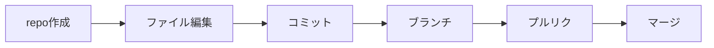

# 練習：通しでやってみる

!!! info "この章のゴール"
    これまで学んだ流れ（**リポジトリ作成 → 変更 → コミット → ブランチ → プルリク → マージ**）を、通しで1回体験すること。

<figure markdown="span">
  { width="320" }
  <figcaption>頭で分かっても、手を動かすと一気に身につきます</figcaption>
</figure>

**練習用のリポジトリ** で気軽に試しましょう（失敗してOK・あとで消せます）。各ステップに **Claudeへの頼み方の例** を載せます。くわしい操作は各章リンクから。



---

## ステップ1：練習用リポジトリを作る

（→ くわしくは [最初の一歩](first-steps.md)）

```text
practice-github という名前で、自分だけが見られる練習用リポジトリを作って。
READMEファイルも付けて。
```

## ステップ2：ファイルを足してコミットする

（→ くわしくは [変更を記録する](commit-push.md)）

```text
README に「これは練習用リポジトリです」と1行書き足して、
変更に合ったメッセージでコミットし、GitHubに反映して。
```

## ステップ3：ブランチを作って変更する

（→ くわしくは [みんなで使う](collaboration.md)）

```text
add-profile というブランチを作って切り替えて、
PROFILE.md というファイルに自己紹介を3行書いて、コミット・プッシュして。
```

## ステップ4：プルリク → 確認 → マージ

```text
いまのブランチの変更でプルリクエストを作って。
内容を確認して、問題なければマージして。使い終わったブランチも片付けて。
```

!!! tip "1つずつ、確認しながら"
    まとめて頼んでもいいですが、最初は **1ステップずつ** 頼んで、GitHubの画面で結果を確認すると、流れがつかみやすいです。

---

## できた！

- [x] リポジトリを作った
- [x] ファイルを変更してコミット・プッシュした
- [x] ブランチ → プルリク → マージ ができた

!!! success "おつかれさまでした 🎉"
    これが、ふだんの作業でも使う **基本の流れ** です。あとは繰り返すうちに自然と身につきます。
    - 言葉に迷ったら → [用語集](glossary.md)
    - つまずいたら → [困ったときのQ&A](troubleshooting.md)
    - もっと使いたくなったら → [もっと使う（上級編）](advanced.md)

!!! success "次のステップ"
    流れに慣れたら、AIと一緒に **何か作ってみましょう**。

    👉 [AIで作ってみる（ハンズオン）](ai-build.md)
