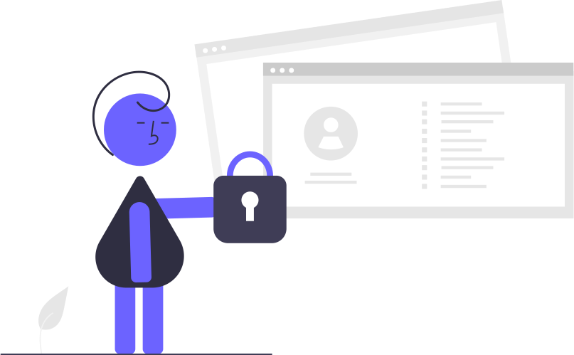

# 安全に使う

!!! info "この章のゴール"
    GitHubを安全に使うための要点（**2段階認証・見せてはいけない情報を上げない・公開範囲**）を押さえること。

<figure markdown="span">
  { width="320" }
  <figcaption>ちょっとの注意で、事故はほぼ防げます</figcaption>
</figure>

## 1. 2段階認証（2FA）をかける

パスワードが万一漏れても、本人以外はログインできなくする仕組みです。**必ず設定**しましょう。

- 設定方法 → [アカウント作成と初期設定](account-setup.md) の「安全のための設定」
- リカバリーコードは安全な場所に保管（社内チャット等に貼らない）

## 2. 見せてはいけない情報を「上げない」

<figure markdown="span">
  { width="300" }
  <figcaption>一度上げると、取り消しても見られた可能性が残ります</figcaption>
</figure>

GitHubに上げたものは、公開（Public）なら **誰でも見られます**。次のものは **絶対に上げない** でください。

- :material-key: **パスワード・APIキー・トークン** などの認証情報
- :material-account: **個人情報**（氏名・住所・電話番号・メールアドレスなど）
- :material-domain: **会社の機密・顧客情報・案件名** など社外秘

!!! tip "上げないための仕組み：`.gitignore`"
    記録したくないファイルは [`.gitignore`](glossary.md) に書いておくと、誤って上げるのを防げます。
    迷ったらClaudeに「このファイルは上げても大丈夫？ `.gitignore` に入れるべき？」と相談を。

!!! danger "もし機密を上げてしまったら"
    publicに上げた認証情報は **「もう漏れた」前提** で、**すぐに無効化（再発行）** してください。
    コミット履歴に残るため、ファイルを消しても見られた可能性があります。履歴からの削除は専門的なので、詳しい人やClaudeに相談しましょう。

## 3. 公開範囲を選ぶ（Public / Private）

| | 見える範囲 | 用途 |
|---|---|---|
| :material-lock: **Private** | 自分（と招待した人）だけ | 社内資料・練習・下書き |
| :material-earth: **Public** | インターネット全体 | 公開してよいものだけ |

!!! warning "迷ったら Private"
    社内向け・個人情報を含む可能性があるものは、**まず Private** にしておくのが安全です。

## この章のまとめ

- [x] 2段階認証（2FA）を設定した
- [x] パスワード・個人情報・機密は **上げない**（`.gitignore` を活用）
- [x] 公開範囲（Public/Private）を理解して選べる

!!! success "次のステップ"
    GitHub側の安全を押さえられました。次は、AIならではの注意点を見ておきましょう。

    👉 [AIと安全に付き合う](ai-safety.md)
