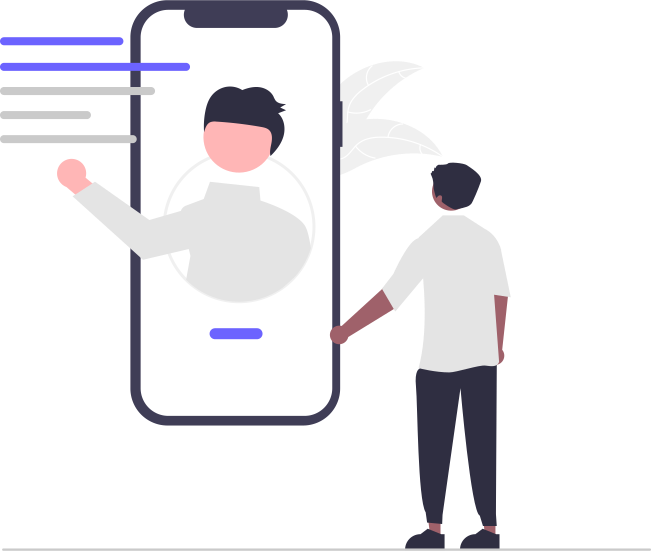

# 困ったときのQ&A

<figure markdown="span">
  { width="300" }
  <figcaption>つまずきやすいポイントと、その対処をまとめます</figcaption>
</figure>

よくあるつまずきと、その対処をまとめます。（順次追記していきます）

!!! tip "まず試したいこと"
    操作に迷ったら、VSCodeのClaudeに **「いまの状況：◯◯。どうすればいい？」** と日本語で聞いてみてください。
    画面の状態に合わせて、次の一手を教えてくれます。

## よくある質問

??? question "間違えてコミットしてしまった。元に戻せる？"
    多くの場合、戻せます。コミットは「セーブポイント」なので、前の状態に戻る道があります。

    - **Claudeに頼む**：`さっきのコミットを取り消して、1つ前の状態に戻して` とお願いする
    - **自分で**：直前なら、VSCodeのソース管理の **「...」メニュー → 前のコミットを元に戻す（Undo Last Commit）** で取り消せます

    !!! warning "あわてず、まず確認"
        すでにプッシュ（GitHubへ反映）した後は、戻し方が変わります。
        不安なときは操作する前に、詳しい人かClaudeに相談しましょう。

??? question "「最新版」がどれか分からなくなった"
    GitHub上が「正」です。ブラウザでリポジトリを開き、ファイルの **コミット履歴（History）** を見れば、最後に更新された内容と日時が分かります。

    - 手元（PC）を最新にしたいときは **プル（Pull）**：`GitHubの最新の状態を取り込んで` とClaudeに頼むか、VSCodeの **同期（Sync）** を押します。

??? question "英語ばかりで何を押せばいいか分からない"
    主要なボタンは下の **早見表** にまとめてあります。
    また、VSCodeは設定で **日本語表示** にできます（→ [PCの準備](setup-pc.md)）。

??? question "プッシュしようとしたらエラーが出た / 認証を求められた"
    多くは **GitHubへのサインインが切れている** ことが原因です。

    1. VSCode左下の **アカウントアイコン** からサインインし直す（→ [PCの準備](setup-pc.md)）
    2. それでも出るエラーは、メッセージをそのままClaudeに貼って `このエラーの意味と直し方を教えて` と聞くのが早いです

??? question "ファイルを消してしまった！"
    GitHubに一度でも反映していれば、過去のコミットから復元できます。
    `消したファイル ◯◯ を、前のコミットから元に戻して` とClaudeに頼むか、GitHub上の履歴から復元します。

## 用語・ボタン早見表

| 英語表記 | 意味 |
|---|---|
| Repository（repo） | リポジトリ（ファイル置き場） |
| Commit | 変更を記録する |
| Push | アップロードする |
| Pull | 取り込む |
| Branch | 作業用の枝分かれ |
| Merge | 本体に合流する |
| Pull Request | 変更の確認依頼 |
| Sign in | サインイン（ログイン） |
| Settings | 設定 |
| Create / Add | 作成／追加 |
| Edit | 編集 |
| Delete | 削除 |
| Confirm | 確定する |

<figure markdown="span">
  { width="300" }
  <figcaption>解決しないときは、ひとりで抱えこまないで</figcaption>
</figure>

!!! tip "それでも解決しないとき"
    - VSCodeのClaudeに、**状況とエラーメッセージをそのまま** 伝えて相談する
    - 社内の詳しい人に聞く
    - 公式ヘルプ（日本語あり）を参照する

!!! success "おつかれさまでした"
    ここまでで、GitHubの基本（アカウント作成 → 準備 → リポジトリ → コミット → 共同作業）が一通り分かりました。
    あとは、実際に手を動かしながら少しずつ慣れていきましょう 🎉
