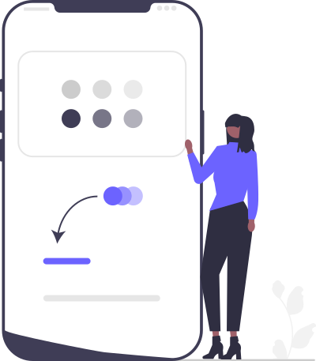

# UI/UX用語集（パーツの名前で直す）

!!! info "このページのゴール"
    画面を **直してほしいとき**、「あの青いやつ」ではなく **「ヘッダー右上のログインボタン」** のように、
    **パーツの名前・状態・位置** を正しく伝えられるようになること。一言が正確になるだけで、修正は一発で伝わります。

<figure markdown="span">
  { width="300" }
  <figcaption>「どこを・どう直すか」を、ブレない言葉で</figcaption>
</figure>

!!! tip "作るときの言葉は別ページにあります"
    「モダンに」「余白を広めに」など **雰囲気・デザインを伝える言葉** は [デザインを言葉で伝える](design-vocab.md) にまとめています。
    このページは **できあがった画面を直す** ときの言葉に特化しています。

---

## なぜ「パーツの名前」で言うの？

**結論：場所と名前を指定すると、AIは「どこを直すか」で迷わなくなります。**

**理由：** AIは画面を“見て”いません。「あの青いボタン」では、画面にボタンがいくつもあると特定できず、見当違いの場所を直してしまいます。
**「パーツ名 ＋ 場所 ＋ 状態」** の3点をそろえると、狙った1か所にピタッと届きます。

**具体例：**

```text
（×）ボタンの色がおかしいから直して
（〇）ヘッダー右上の「ログイン」ボタンを、ホバーしたときだけ濃い青にして
```

!!! note "3点セットで伝えると一発"
    **① パーツ名**（ボタン・モーダルなど）＋ **② 場所**（ヘッダー右上・カードの下など）＋ **③ 状態**（ホバー時・無効のとき）。
    この3つを意識するだけで、修正依頼の精度が大きく上がります。

<style>
/* === UI用語ミニ見本（このページ専用・uv- 接頭辞でスコープ）=== */
.uv-grid{display:grid;grid-template-columns:repeat(auto-fill,240px);gap:22px;margin:1.4em 0;justify-content:center;}
.uv-item{width:240px;margin:0;}
.uv-item figcaption{font-size:.78rem;line-height:1.5;margin-top:.5em;color:var(--md-default-fg-color--light);}
.uv-item figcaption b{color:var(--md-default-fg-color);}
.uv-screen{width:240px;border-radius:11px;overflow:hidden;box-shadow:0 4px 16px rgba(0,0,0,.14);border:1px solid rgba(0,0,0,.08);background:#fff;font-family:system-ui,-apple-system,"Segoe UI",sans-serif;}
.uv-bar{height:22px;background:#f0f0f4;display:flex;align-items:center;gap:5px;padding:0 9px;}
.uv-bar i{width:8px;height:8px;border-radius:50%;background:#d2d2da;display:inline-block;}
.uv-page{padding:16px 16px;min-height:150px;display:flex;flex-direction:column;gap:10px;background:#fff;position:relative;}

/* --- 状態（ボタン）--- */
.uv-states{padding:16px;display:flex;flex-direction:column;gap:9px;align-items:flex-start;min-height:150px;justify-content:center;}
.uv-sb{font-size:11px;padding:8px 16px;border-radius:7px;font-weight:600;display:inline-flex;align-items:center;gap:6px;}
.uv-sb.normal{background:#4f46e5;color:#fff;}
.uv-sb.hover{background:#3d35c9;color:#fff;box-shadow:0 5px 12px rgba(79,70,229,.4);transform:translateY(-1px);}
.uv-sb.disabled{background:#dcdce3;color:#9a9aa3;}
.uv-sb.loading{background:#4f46e5;color:#fff;opacity:.85;}
.uv-spin{width:11px;height:11px;border:2px solid rgba(255,255,255,.4);border-top-color:#fff;border-radius:50%;display:inline-block;animation:uvspin .8s linear infinite;}
@keyframes uvspin{to{transform:rotate(360deg);}}
.uv-tag{font-size:8px;color:#999;font-weight:500;}

/* --- 状態（入力欄）--- */
.uv-fields{padding:16px;display:flex;flex-direction:column;gap:11px;justify-content:center;min-height:150px;}
.uv-fld{display:flex;flex-direction:column;gap:3px;}
.uv-fld .l{font-size:9px;color:#888;}
.uv-fld .i{height:24px;border-radius:5px;border:1px solid #ccc;background:#fff;}
.uv-fld.focus .i{border-color:#4f46e5;box-shadow:0 0 0 3px rgba(79,70,229,.18);}
.uv-fld.error .i{border-color:#e5484d;}
.uv-fld.error .l{color:#e5484d;}
.uv-fld .e{font-size:8px;color:#e5484d;}

/* --- 状態（選択中タブ）--- */
.uv-seltabs{display:flex;border-bottom:2px solid #e3e3ee;}
.uv-seltabs span{font-size:10px;padding:9px 12px;color:#999;}
.uv-seltabs span.on{color:#4f46e5;border-bottom:2px solid #4f46e5;margin-bottom:-2px;font-weight:700;}

/* --- 位置・領域 --- */
.uv-pos{padding:0;min-height:170px;}
.uv-region{position:absolute;background:rgba(79,70,229,.12);border:1px dashed #4f46e5;display:flex;align-items:center;justify-content:center;font-size:8px;color:#4f46e5;font-weight:700;border-radius:4px;}
.uv-dot{position:absolute;width:18px;height:18px;border-radius:50%;background:#4f46e5;color:#fff;font-size:9px;font-weight:700;display:flex;align-items:center;justify-content:center;box-shadow:0 2px 6px rgba(0,0,0,.25);}
.uv-frame{position:relative;width:100%;height:170px;background:#fafafe;}
.uv-top{top:8px;left:8px;right:8px;height:24px;}
.uv-bottom{bottom:8px;left:8px;right:8px;height:22px;}
.uv-left{top:40px;bottom:36px;left:8px;width:54px;}
.uv-center{top:70px;left:50%;transform:translateX(-50%);width:88px;height:34px;}

/* --- パーツ見本（小物）--- */
.uv-parts{padding:16px;display:flex;flex-wrap:wrap;gap:14px;align-items:center;justify-content:center;min-height:150px;}
.uv-toast{background:#26262e;color:#fff;font-size:9px;padding:8px 12px;border-radius:7px;box-shadow:0 4px 12px rgba(0,0,0,.3);display:flex;align-items:center;gap:6px;}
.uv-toast::before{content:"✓";color:#5be584;font-weight:700;}
.uv-chip{font-size:9px;padding:3px 10px;border-radius:999px;background:#eef0f7;color:#444;border:1px solid #e0e2ee;display:inline-flex;align-items:center;gap:4px;}
.uv-chip span{color:#999;}
.uv-tip{position:relative;font-size:10px;background:#4f46e5;color:#fff;padding:5px 10px;border-radius:6px;}
.uv-tip::after{content:"";position:absolute;bottom:-5px;left:18px;border:5px solid transparent;border-top-color:#4f46e5;border-bottom:0;}
.uv-prog{width:120px;height:8px;border-radius:999px;background:#e3e3ee;overflow:hidden;}
.uv-prog::after{content:"";display:block;width:62%;height:100%;background:#4f46e5;}
.uv-avatar{width:34px;height:34px;border-radius:50%;background:linear-gradient(135deg,#5b54f0,#8b5cf6);color:#fff;font-size:12px;font-weight:700;display:flex;align-items:center;justify-content:center;}
.uv-dropdown{width:110px;border:1px solid #ccc;border-radius:6px;overflow:hidden;font-size:10px;}
.uv-dropdown .h{padding:6px 10px;display:flex;justify-content:space-between;color:#333;background:#fff;}
.uv-dropdown .h span{color:#999;}
.uv-dropdown .o{padding:5px 10px;background:#f5f6fc;color:#4f46e5;border-top:1px solid #eee;}
</style>

---

## 1. パーツの呼び名

「ここにこれを置いて」「これを直して」と頼むときに使う、**部品そのものの名前** です。
名前で言えると一発で伝わります。

### よく使う小さな部品

<div class="uv-grid" markdown="0">

<figure class="uv-item">
  <div class="uv-screen"><div class="uv-bar"><i></i><i></i><i></i></div>
  <div class="uv-page uv-parts"><span class="uv-chip">下書き <span>×</span></span><span class="uv-chip">公開中 <span>×</span></span></div></div>
  <figcaption><b>チップ／タグ</b><br>小さなラベル状の印。状態や絞り込みに使う。</figcaption>
</figure>

<figure class="uv-item">
  <div class="uv-screen"><div class="uv-bar"><i></i><i></i><i></i></div>
  <div class="uv-page uv-parts"><div class="uv-toast">保存しました</div></div></div>
  <figcaption><b>トースト／スナックバー</b><br>画面の端に一瞬出て消える通知。</figcaption>
</figure>

<figure class="uv-item">
  <div class="uv-screen"><div class="uv-bar"><i></i><i></i><i></i></div>
  <div class="uv-page uv-parts"><div class="uv-tip">ここを押すと保存</div></div></div>
  <figcaption><b>ツールチップ</b><br>乗せると出る小さな吹き出し説明。</figcaption>
</figure>

<figure class="uv-item">
  <div class="uv-screen"><div class="uv-bar"><i></i><i></i><i></i></div>
  <div class="uv-page uv-parts"><div class="uv-avatar">A</div><div class="uv-prog"></div></div></div>
  <figcaption><b>アバター／プログレスバー</b><br>丸いユーザー画像／進み具合の帯。</figcaption>
</figure>

<figure class="uv-item">
  <div class="uv-screen"><div class="uv-bar"><i></i><i></i><i></i></div>
  <div class="uv-page uv-parts"><div class="uv-dropdown"><div class="h">東京都 <span>▾</span></div><div class="o">大阪府</div></div></div></div>
  <figcaption><b>ドロップダウン／セレクト</b><br>押すと候補が下に開いて選ぶ。</figcaption>
</figure>

</div>

### 名前の早見表

| パーツ名 | どんなもの | こう頼む（例） |
|---|---|---|
| **ボタン** | 押す操作の部品 | `「送信」ボタンを大きくして` |
| **リンク** | 押すと別ページへ飛ぶ文字 | `下線付きのリンクにして` |
| **アイコン** | 絵文字状の小さな図記号 | `ゴミ箱アイコンを赤くして` |
| **入力欄（テキストフィールド）** | 文字を打ち込む枠 | `入力欄の幅を広げて` |
| **チェックボックス** | オン/オフの四角い印 | `「同意する」をチェックボックスに` |
| **ラジオボタン** | 1つだけ選ぶ丸い印 | `性別はラジオボタンで` |
| **トグル（スイッチ）** | オン/オフの切替スイッチ | `通知設定はトグルで` |
| **ドロップダウン／セレクト** | 押すと候補が開く | `都道府県はドロップダウンで` |
| **スライダー** | つまみを動かして調整 | `音量はスライダーで` |
| **ヘッダー** | 画面上部の帯 | `ヘッダーにロゴを置いて` |
| **フッター** | 画面下部の帯 | `フッターに会社情報を` |
| **ナビバー／ナビゲーション** | 案内メニューの並び | `上のナビに「お問い合わせ」を追加` |
| **サイドバー** | 横のメニュー列 | `左のサイドバーを細くして` |
| **ハンバーガーメニュー** | 三本線の開閉ボタン | `スマホは右上にハンバーガーメニュー` |
| **パンくず（リスト）** | 現在地の道しるべ | `上にパンくずを表示して` |
| **タブ** | 切り替えて中身を出し分け | `「概要／詳細」のタブにして` |
| **モーダル／ダイアログ** | 手前に重なる小窓 | `削除の確認はモーダルで` |
| **ポップアップ** | 重ねて出す小窓全般 | `説明をポップアップで出して` |
| **トースト／スナックバー** | 一瞬出て消える通知 | `保存したらトーストで知らせて` |
| **ツールチップ** | 乗せると出る吹き出し説明 | `アイコンにツールチップを` |
| **アコーディオン** | 開閉する折りたたみ | `Q&Aはアコーディオンに` |
| **カード** | 四角いパネルの区切り | `商品はカードで並べて` |
| **テーブル（表）** | 行と列の表 | `一覧はテーブルで表示` |
| **リスト** | 縦に並ぶ項目 | `箇条書きのリストにして` |
| **バッジ** | 件数・状態の小さな印 | `未読数をバッジで` |
| **チップ／タグ** | 小さなラベル状の印 | `カテゴリをタグで` |
| **アバター** | 丸いユーザー画像 | `アバターを丸く表示` |
| **プログレスバー** | 進み具合の帯 | `読み込み中はプログレスバーを` |
| **スピナー／ローダー** | くるくる回る読込中の印 | `読み込み中はスピナーを` |
| **ページネーション** | ページ送りの番号 | `下にページネーションを` |
| **カルーセル／スライダー** | 横スクロールの切替表示 | `写真はカルーセルで` |
| **プレースホルダー** | 入力欄の薄い見本文字 | `「例：山田太郎」のプレースホルダーを` |
| **ラベル** | 入力欄などの見出し文字 | `入力欄の上にラベルを` |
| **フォーム** | 入力欄のまとまり | `問い合わせフォームを追加` |

!!! tip "名前が分からなくても大丈夫"
    名前が出てこないときは **「〇〇の右にある、押すと候補が下に出てくるやつ」** のように、
    **場所＋動き** で説明すればOKです（このページの「3. 位置・領域」が役立ちます）。

---

## 2. パーツの「状態」

同じボタンでも、**ふだん／乗せたとき／押せないとき** で見た目が変わります。
「**どの状態のとき** を直すか」を言うと、ピンポイントで直せます。

### ボタンの状態

<div class="uv-grid" markdown="0">

<figure class="uv-item">
  <div class="uv-screen"><div class="uv-bar"><i></i><i></i><i></i></div>
  <div class="uv-page uv-states"><span class="uv-sb normal">送信</span><span class="uv-tag">通常（ふだん）</span><span class="uv-sb hover">送信</span><span class="uv-tag">ホバー（乗せたとき）</span><span class="uv-sb disabled">送信</span><span class="uv-tag">無効（押せない）</span><span class="uv-sb loading"><span class="uv-spin"></span>送信中</span><span class="uv-tag">読込中（処理中）</span></div></div>
  <figcaption><b>ボタンの4状態</b><br>通常／ホバー／無効（disabled）／読込中。</figcaption>
</figure>

</div>

### 入力欄・タブの状態

<div class="uv-grid" markdown="0">

<figure class="uv-item">
  <div class="uv-screen"><div class="uv-bar"><i></i><i></i><i></i></div>
  <div class="uv-page uv-fields"><div class="uv-fld focus"><span class="l">お名前</span><span class="i"></span></div><div class="uv-fld error"><span class="l">メール</span><span class="i"></span><span class="e">形式が正しくありません</span></div></div></div>
  <figcaption><b>フォーカス／エラー</b><br>選択中は枠が光る／エラーは赤くなる。</figcaption>
</figure>

<figure class="uv-item">
  <div class="uv-screen"><div class="uv-bar"><i></i><i></i><i></i></div>
  <div class="uv-page" style="padding:0;"><div class="uv-seltabs"><span class="on">概要</span><span>詳細</span><span>口コミ</span></div><div style="padding:14px;font-size:10px;color:#999;">「概要」が選択中（アクティブ）</div></div></div>
  <figcaption><b>選択中（アクティブ）</b><br>いま開いているタブ/項目の状態。</figcaption>
</figure>

</div>

| 状態の言葉 | どんなとき | こう頼む（例） |
|---|---|---|
| **通常（デフォルト）** | ふだんの見た目 | `通常時は薄いグレーで` |
| **ホバー** | マウスを乗せたとき | `ホバーしたら色を濃くして` |
| **フォーカス** | クリック/選択して入力できる状態 | `フォーカス中は枠を青く光らせて` |
| **アクティブ／選択中** | 押している／いま選ばれている | `選択中のタブだけ太字に` |
| **無効（disabled／グレーアウト）** | 押せない状態 | `未入力のうちは送信ボタンを無効に` |
| **読込中（ローディング）** | 処理を待っている | `送信中はスピナーを出してボタンを無効に` |
| **エラー** | 入力ミスや失敗 | `メール欄がエラーなら赤枠と文言を` |
| **成功** | 完了した | `保存できたら緑のトーストを` |
| **空（からっぽ／empty state）** | データが1件もない | `データが無いときは「まだありません」と表示` |

!!! tip "「〇〇のときだけ」と言うのがコツ"
    `ホバーのときだけ` `エラーのときだけ` のように **状態を限定** すると、ほかの状態を壊さずに直せます。

---

## 3. 位置・領域の言い方

「どこの」を正確に言うための言葉です。**パーツ名と組み合わせる** と一気に伝わります。

<div class="uv-grid" markdown="0">

<figure class="uv-item">
  <div class="uv-screen"><div class="uv-bar"><i></i><i></i><i></i></div>
  <div class="uv-page uv-pos"><div class="uv-frame"><div class="uv-region uv-top">上部（ヘッダー）</div><div class="uv-region uv-left">左<br>サイド</div><div class="uv-region uv-center">中央</div><div class="uv-region uv-bottom">下部（フッター）</div></div></div></div>
  <figcaption><b>領域の呼び名</b><br>上部／下部／左サイド／中央など、大きな場所。</figcaption>
</figure>

<figure class="uv-item">
  <div class="uv-screen"><div class="uv-bar"><i></i><i></i><i></i></div>
  <div class="uv-page uv-pos"><div class="uv-frame"><div class="uv-dot" style="top:8px;left:8px;">1</div><div class="uv-dot" style="top:8px;right:8px;">2</div><div class="uv-dot" style="bottom:8px;left:8px;">3</div><div class="uv-dot" style="bottom:8px;right:8px;">4</div></div></div></div>
  <figcaption><b>四隅</b><br>①左上 ②右上 ③左下 ④右下。「右上のボタン」のように使う。</figcaption>
</figure>

</div>

| 言い方 | 意味 | 組み合わせ例 |
|---|---|---|
| **上部／下部** | 画面の上のほう／下のほう | `下部に固定でボタンを置いて` |
| **左／右／中央** | 横方向の位置 | `見出しを中央寄せに` |
| **左上／右上／左下／右下** | 四隅 | `右上に閉じるボタンを` |
| **〇〇の上／下** | あるパーツの上下 | `タイトルの下に説明文を` |
| **〇〇の隣／横** | あるパーツの横 | `アイコンの隣に文字を` |
| **〇〇の中** | あるパーツの内側 | `カードの中にボタンを` |
| **ファーストビュー** | 最初に見える1画面分 | `ファーストビューに連絡先を` |
| **画面の外（はみ出し）** | 表示領域からあふれている | `スマホで表が画面外にはみ出してる` |
| **固定（sticky／追従）** | スクロールしても付いてくる | `ヘッダーを上に固定して` |

!!! warning "「上」「下」は基準を添えると確実"
    ただ「上に」だと画面の上か、あるパーツの上か紛れます。
    **「タイトルの下」「ヘッダーの中の右」** のように **基準のパーツ名** を添えると誤解がありません。

---

## 4. そのまま使える修正依頼フレーズ集

「パーツ名 ＋ 場所 ＋ 状態 ＋ どうしたい」の型です。コピーして、`〇〇` の部分を書き換えて使ってください。

```text
【見た目を変える】
・ヘッダー右上の「ログイン」ボタンを、もう少し大きく・濃い青にして。
・カードの角丸をもっと大きくして、軽い影をつけて。
・本文の文字が小さいので、1段階大きくして行間も広げて。

【状態を変える】
・送信ボタンは、未入力のうちは無効（グレーアウト）にして、押せないようにして。
・入力欄にマウスを乗せた（ホバー）ときだけ、枠を少し濃くして。
・送信中はボタンをスピナー表示にして、二重送信できないようにして。

【場所を変える・追加する】
・スマホのとき、ナビを右上のハンバーガーメニューにまとめて。
・フッターの中央に、コピーライトを1行で追加して。
・一覧の下にページネーションを置いて。

【直してほしい不具合】
・スマホで表が画面の右にはみ出しているので、収まるようにして。
・モーダルを閉じるボタン（右上の×）が効かないので直して。
・エラーのとき、入力欄が赤くならないので赤枠とメッセージを出して。
```

!!! tip "「どこを」が分かる画面を見せるともっと早い"
    可能なら **スクリーンショット** を貼って `この赤丸のボタン` のように指せると、名前が曖昧でも確実に伝わります。

!!! warning "貼る前の確認"
    スクリーンショットや文章に **実在の顧客名・案件名・社内システム名や認証情報（パスワード・APIキー等）** が写り込んでいないか確認してください（→ [AIと安全に付き合う](ai-safety.md)）。

---

## このページのまとめ

- [x] **パーツの呼び名**（ボタン・モーダル・トグルなど）が分かった
- [x] **状態**（ホバー・無効・読込中・エラーなど）を限定して頼める
- [x] **位置・領域**（右上・〇〇の下・固定など）で場所を正確に指せる
- [x] 「**パーツ名 ＋ 場所 ＋ 状態**」の3点セットで一発で伝わる
- [x] スクショや依頼文に **実在の顧客名・機密** は入れない

!!! success "次のステップ"
    見た目の言葉も合わせて使うと、もっと思い通りになります。

    👉 [デザインを言葉で伝える](design-vocab.md)
